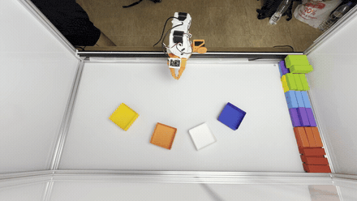
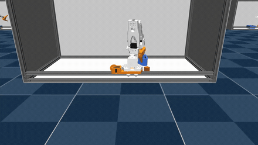
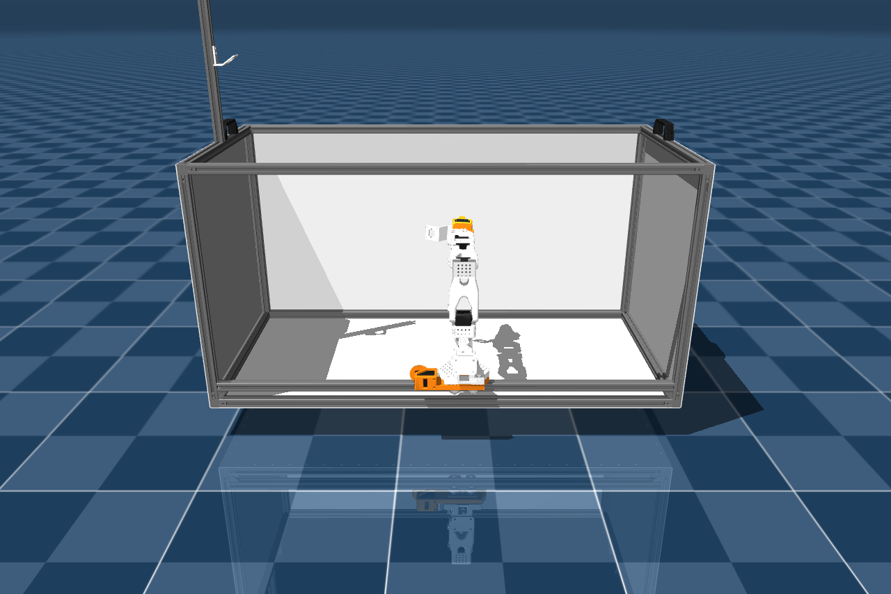
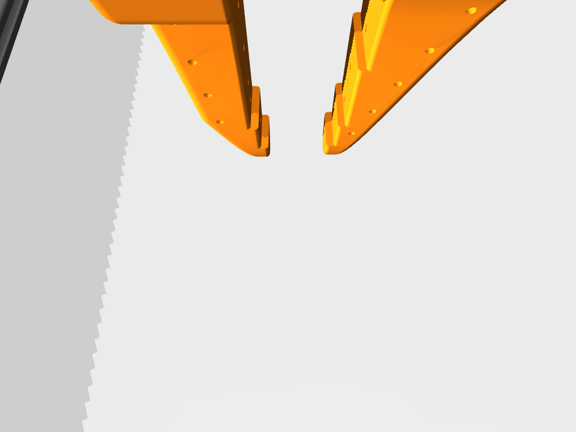
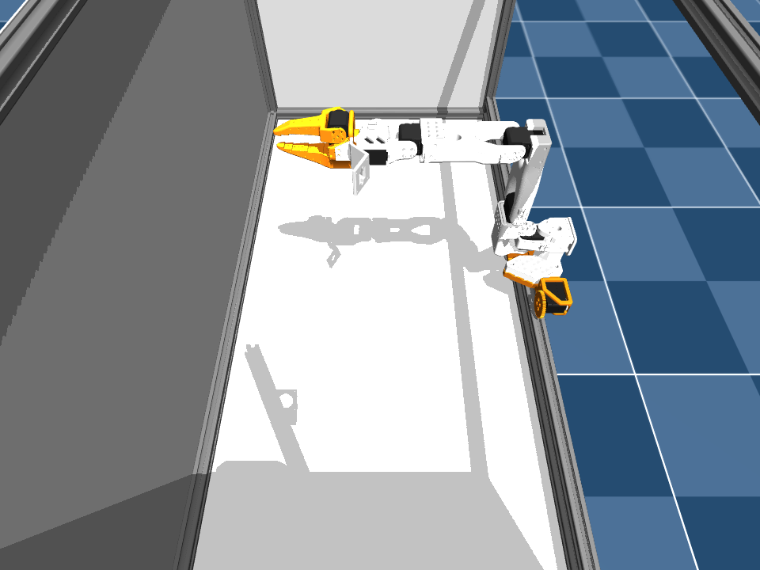
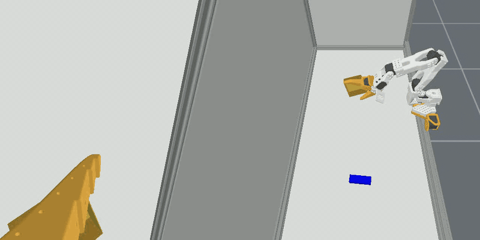

# SO-Frame

SO-Frame is a cheap, open evaluation frame for SO101 arms (with the LeSlider add-on), built
at [LiveKit](https://livekit.io) as a reproducible environment for debugging our robotics
products: [Portal](https://github.com/livekit/portal) and
[Agents](https://github.com/livekit/agents). It ships with a [simulation](#simulation)
(URDF + MuJoCo + USD) and a complementary [reinforcement-learning](#reinforcement-learning)
pick-and-place task, solved two ways (state-based and vision-based) built on it.

|                              Real                               |                                      RL in Sim                                      |
| :-------------------------------------------------------------: | :---------------------------------------------------------------------------------: |
|  |  |

## Quick links

- [Bill of Materials](#bill-of-materials)
- [CAD (Onshape)](https://cad.onshape.com/documents/e30ffd8480ec1a7673eb62f7/w/bb71304b5f8bcda7c376a401/e/bfa112e7dd1062bab3fa5a65)
- [Simulation (URDF + MuJoCo + USD)](#simulation)
- [Reinforcement Learning](#reinforcement-learning)

## Bill of Materials

The box frame is built entirely from **2020 (20×20 mm) T-slot aluminium extrusion**. The
[LeSlider][leslider] add-on provides the 1-DOF linear motion and has its own BOM.

> Amazon links below are examples (US) to show the right part. Brands and pack sizes vary
> and listings change, so double-check specs before buying.

### Aluminium extrusion

| Part                  | Length           | Qty | Example link                                   |
| --------------------- | ---------------- | --- | ---------------------------------------------- |
| 2020 T-slot extrusion | 1000 mm (100 cm) | 5   | [Amazon](https://www.amazon.com/dp/B07Z787MB8) |
| 2020 T-slot extrusion | 500 mm (50 cm)   | 9   | [Amazon](https://www.amazon.com/dp/B07Z7H8MZG) |

**Total: 9.5 m** of 2020 extrusion (5 × 1 m + 9 × 0.5 m). Extrusion is usually sold in
fixed lengths or cut-to-order, so buy to match or cut longer stock down.

### Brackets & handles

| Part                                    | Qty | Example link                                                                                             |
| --------------------------------------- | --- | -------------------------------------------------------------------------------------------------------- |
| 3-way hidden corner bracket (2020)      | 8   | [Amazon (8-pack)](https://www.amazon.com/dp/B08C9Q2TGW)                                                  |
| 2020 angle bracket (L / profile joiner) | 2   | [Amazon](https://www.amazon.com/dp/B07GGLYX9V)                                                           |
| Handle                                  | 2   | [Amazon (2-pack)](https://www.amazon.com/JiGiU-Aluminium-Rectangular-Industrial-Extrusion/dp/B0DT4C119Q) |

### Fasteners

Every bracket/handle screw pairs with a matching drop-in **T-nut**. Use **M5** or **M4** to
match your bracket & T-nut kit. 2020 kits are usually **M5** (some use **M4**); the counts
are the same either way. An assortment kit like
[this M5 T-nut + button-head screw set](https://www.amazon.com/dp/B0DZH4HCF1) covers all of
the below.

| Used on                  | Screws / part | Screws | T-nuts |
| ------------------------ | ------------- | ------ | ------ |
| 3-way corner bracket × 8 | 3             | 24     | 24     |
| Angle bracket × 2        | 2             | 4      | 4      |
| Handle × 2               | 2             | 4      | 4      |
| **Total**                |               | **32** | **32** |

> **Verify against your kit.** Fasteners aren't all modelled in the URDF, so these are the
> typical counts: hidden 3-way brackets are assumed at 3 bolts + 3 T-nuts each. Some 3-way
> brackets instead use 6 bolts, or grub/set screws that thread into the extrusion end (no
> T-nut). Adjust to whatever hardware ships with your brackets.

### Side panels (CNC)

The flat panels that skin the frame (the matte side panels in the renders) are CNC-cut from
**white mica sheet**. Each DXF below is one cut, so cut one of each except the short side
panel, which is cut twice.

| Panel            | DXF                                                          | Cuts |
| ---------------- | ------------------------------------------------------------ | ---- |
| Top panel        | [top-panel.dxf](components/cnc/top-panel.dxf)                | 1    |
| Bottom panel     | [bottom-panel.dxf](components/cnc/bottom-panel.dxf)          | 1    |
| Long side panel  | [long-side-panel.dxf](components/cnc/long-side-panel.dxf)    | 1    |
| Short side panel | [short-side-panel.dxf](components/cnc/short-side-panel.dxf)  | 2    |

### LeSlider add-on

The sliding carriage that carries the arm is the [LeSlider][leslider] mechanism (V-wheel
gantry + rack & pinion). It adds its own hardware: 4× V-wheel assemblies, 4× M5×25
low-profile screws, 4× M5 nylock nuts, eccentric spacers, and the pinion/rack. See the
[LeSlider][leslider] BOM.

[leslider]: https://github.com/pham-tuan-binh/leslider

## Simulation

The SO-Frame + SO-101 + two cameras, described three ways that share the same meshes: a
**URDF**, a **MuJoCo (MJCF)** model, and a **USD** scene. The arm mounts on the frame's
slider, with a wrist camera and an overhead camera.

### URDF

`simulation/urdf/so101_on_frame.urdf` is the combined model for URDF viewers, PyBullet,
Isaac, etc. It includes the slider joint, the arm, and both camera frames
(`frame_wrist_camera`, `frame_overhead_camera`). See
**[simulation/urdf/README.md](simulation/urdf/README.md)** for kinematics, joint limits, the
mounting details, and the interactive camera-alignment helper.



### MJCF (MuJoCo)

`simulation/mjcf/scene.xml` is the MuJoCo model. On top of the URDF geometry it adds
actuators, box collisions for the frame, a floor/light/skybox, and the two cameras as real
renderable MuJoCo cameras. Load it with:

```bash
python -m mujoco.viewer --mjcf=simulation/mjcf/scene.xml
```

See **[simulation/mjcf/README.md](simulation/mjcf/README.md)** for actuators, collision, and
camera details.

Same setup, plus what each camera sees:

|                 Setup                 |               `frame_wrist_camera`               |                `frame_overhead_camera`                 |
| :-----------------------------------: | :----------------------------------------------: | :----------------------------------------------------: |
|  |  |  |

### USD (OpenUSD)

`simulation/usd/so101_on_frame.usd` is a USD scene with physically-based materials
(aluminium, matte mica side panels, white/orange PLA, black plastic, steel) and soft
overhead lighting, for usdview / Blender / Omniverse. See
**[simulation/usd/README.md](simulation/usd/README.md)**.

|                      Setup                      |                 `frame_wrist_camera`                 |                  `frame_overhead_camera`                   |
| :---------------------------------------------: | :--------------------------------------------------: | :--------------------------------------------------------: |
|  |  |  |

## Reinforcement Learning

`rl/` holds the training environments, the shared policy definition, and the deploy stack:

```
rl/environments/maniskill/   vision-based RL (camera pixels only)  -- feeds deploy
rl/environments/mjlab/       state-based RL (ground-truth poses)
rl/policy/                   the encoder, actor and checkpoint format
rl/deploy/                   run a checkpoint on the physical rig
```

Both environments implement the same **pick-up-a-cube-and-place-it-in-a-bin** task, with the
cube and bin randomized each episode; they differ in what the policy observes. See
**[rl/README.md](rl/README.md)** for how the four fit together.

### `rl/environments/mjlab/`


Built on [mjlab](https://github.com/mujocolab/mjlab) (Isaac Lab's manager-based API on
GPU-accelerated MuJoCo-Warp), using the [simulation](#simulation) MJCF model. Trains with
PPO (rsl-rl) across thousands of parallel environments on ground-truth cube/bin poses.

> **Heads up on the current policy.** It doesn't actually pick and place. The policy found a
> shortcut and instead **putts the cube like a golf shot**, whacking it across the workspace
> and into the bin rather than grasping and lifting it. It's a fun bit of reward hacking, and
> the reward shaping is still being tuned to coax out a proper grasp.

It's a [uv](https://docs.astral.sh/uv/) project. From `rl/environments/mjlab/`:

```bash
uv sync
uv run soframe-train Mjlab-Pick-Place-Bin-SO101
uv run soframe-play  Mjlab-Pick-Place-Bin-SO101 --checkpoint-file <path>
```

Training parameters live in `rl/environments/mjlab/train.toml`. Because it runs on MuJoCo-Warp, training
needs a **Linux + NVIDIA GPU** machine (macOS can build and CPU smoke-test). See
**[rl/environments/mjlab/README.md](rl/environments/mjlab/README.md)** for the full environment, reward, curriculum,
manager, and config details.

### `rl/environments/maniskill/`



*Chained rollouts (wrist camera left, overhead camera right), rendered in the flat shading
they were trained on.*

Trains purely from **the frame's own two cameras** (wrist + overhead): no ground-truth cube/bin poses, just
RGB pixels and proprioception. Built on [ManiSkill3](https://github.com/haosulab/ManiSkill)
(SAPIEN + PhysX, GPU-parallel), implementing [Squint: Fast Visual Reinforcement Learning for
Sim-to-Real Robotics](https://arxiv.org/abs/2602.21203) (Almuzairee & Christensen, 2026), a
visual Soft Actor-Critic that reaches strong success rates in **minutes** of wall-clock time.

This folder started as a port of the paper's [reference implementation](https://github.com/aalmuzairee/squint)
(which already targets an SO-101 arm in ManiSkill3), retargeted onto this repo's
frame-mounted rig and its existing calibrated `frame_wrist_camera`/`frame_overhead_camera`
mounts and `simulation/urdf/so101_on_frame.urdf`. The SAC loop is still the paper's; the
vision encoder is selectable, either the paper's low-resolution CNN or a frozen DINOv2
backbone read out densely or pooled to one vector per camera. See
**[rl/environments/maniskill/README.md](rl/environments/maniskill/README.md)**.

**SAPIEN vs MuJoCo camera convention**: the two engines define a camera's local forward/right/up
axes differently. SAPIEN uses `(forward, right, up) = (+X, -Y, +Z)` (see
`sapien_utils.look_at`'s docstring), while MuJoCo uses `(forward, right, up) = (-Z, +X, +Y)`.
Both `simulation/urdf/so101_on_frame.urdf` and `simulation/mjcf/so101_on_frame.xml` calibrate
their camera joints/bodies from the same physical mount, at the same position, but the URDF's
rotation is the MJCF's rotation converted through this fixed axis remap (a constant rotation
`P` with `R_sapien = R_mujoco @ P`), not a copy of the MJCF's raw quaternion: porting the
quaternion directly renders the wrong direction in SAPIEN despite the shared calibration.

It's a [uv](https://docs.astral.sh/uv/) project. From `rl/environments/maniskill/`:

```bash
uv sync
uv run python examples/visualize_sim.py
uv run python train.py                      # squint CNN
uv run python train.py --encoder dino_patch # frozen DINOv2 + patch head
```

Task, robot and reward constants live in `rl/environments/maniskill/src/soframe_rl_maniskill/config.py`.
The encoder, actor and checkpoint format are shared with deploy in
**[policy/](policy/README.md)**.

Needs a **Linux + NVIDIA GPU** machine (ManiSkill3/SAPIEN + CUDA; macOS can read/edit code but
not train). See **[rl/environments/maniskill/README.md](rl/environments/maniskill/README.md)** for the task,
observation/reward design, domain randomization, and training details.
