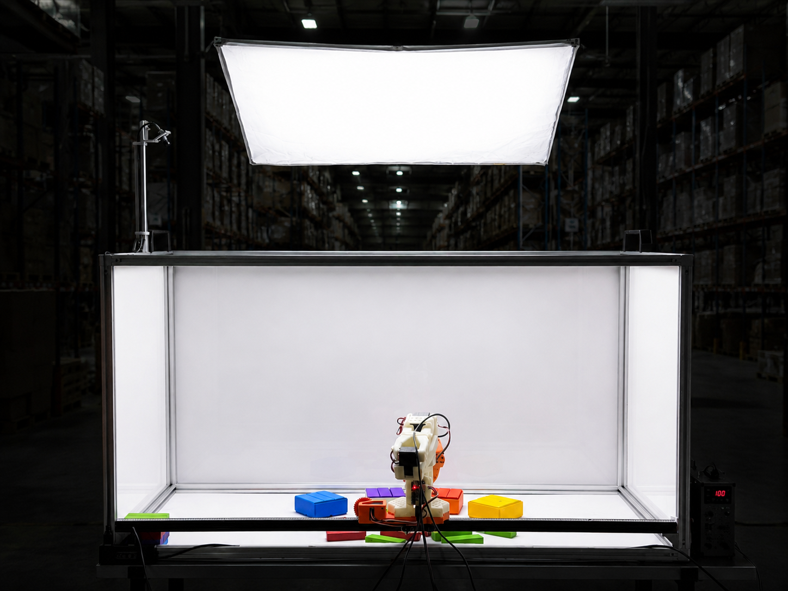

# SO-Frame

SO-Frame is a cheap and simple evaluation frame for SO101 arms with LeSlider add-on.

## Quick links

- [Bill of Materials](#bill-of-materials)
- [CAD (Onshape)](https://cad.onshape.com/documents/e30ffd8480ec1a7673eb62f7/w/bb71304b5f8bcda7c376a401/e/bfa112e7dd1062bab3fa5a65)
- [Simulation (URDF)](simulation/urdf/README.md)

## Bill of Materials

The box frame is built entirely from **2020 (20×20 mm) T-slot aluminium extrusion**. The
[LeSlider][leslider] add-on provides the 1-DOF linear motion and has its own BOM.

> Amazon links below are examples (US) to show the right part. Brands and pack sizes vary
> and listings change, so double-check specs before buying.

### Aluminium extrusion

| Part                  | Length           | Qty | Example link                                   |
| --------------------- | ---------------- | --- | ---------------------------------------------- |
| 2020 T-slot extrusion | 1000 mm (100 cm) | 5   | [Amazon](https://www.amazon.com/dp/B07Z787MB8) |
| 2020 T-slot extrusion | 500 mm (50 cm)   | 9   | [Amazon](https://www.amazon.com/dp/B07Z7H8MZG) |

**Total: 9.5 m** of 2020 extrusion (5 × 1 m + 9 × 0.5 m). Extrusion is usually sold in
fixed lengths or cut-to-order, so buy to match or cut longer stock down.

### Brackets & handles

| Part                                    | Qty | Example link                                                                                             |
| --------------------------------------- | --- | -------------------------------------------------------------------------------------------------------- |
| 3-way hidden corner bracket (2020)      | 8   | [Amazon (8-pack)](https://www.amazon.com/dp/B08C9Q2TGW)                                                  |
| 2020 angle bracket (L / profile joiner) | 2   | [Amazon](https://www.amazon.com/dp/B07GGLYX9V)                                                           |
| Handle                                  | 2   | [Amazon (2-pack)](https://www.amazon.com/JiGiU-Aluminium-Rectangular-Industrial-Extrusion/dp/B0DT4C119Q) |

### Fasteners

Every bracket/handle screw pairs with a matching drop-in **T-nut**. Use **M5** or **M4** to
match your bracket & T-nut kit. 2020 kits are usually **M5** (some use **M4**); the counts
are the same either way. An assortment kit like
[this M5 T-nut + button-head screw set](https://www.amazon.com/dp/B0DZH4HCF1) covers all of
the below.

| Used on                  | Screws / part | Screws | T-nuts |
| ------------------------ | ------------- | ------ | ------ |
| 3-way corner bracket × 8 | 3             | 24     | 24     |
| Angle bracket × 2        | 2             | 4      | 4      |
| Handle × 2               | 2             | 4      | 4      |
| **Total**                |               | **32** | **32** |

> **Verify against your kit.** Fasteners aren't all modelled in the URDF, so these are the
> typical counts: hidden 3-way brackets are assumed at 3 bolts + 3 T-nuts each. Some 3-way
> brackets instead use 6 bolts, or grub/set screws that thread into the extrusion end (no
> T-nut). Adjust to whatever hardware ships with your brackets.

### LeSlider add-on

The sliding carriage that carries the arm is the [LeSlider][leslider] mechanism (V-wheel
gantry + rack & pinion). It adds its own hardware: 4× V-wheel assemblies, 4× M5×25
low-profile screws, 4× M5 nylock nuts, eccentric spacers, and the pinion/rack. See the
[LeSlider][leslider] BOM.

[leslider]: https://github.com/pham-tuan-binh/leslider

## Simulation

A ready-to-use combined URDF (`simulation/urdf/so101_on_frame.urdf`) mounts the SO-101 arm
on the frame's slider, including a wrist camera. See
**[simulation/urdf/README.md](simulation/urdf/README.md)** for the
kinematics, joint limits, mounting details, and the interactive alignment helper.
