# Zero-shot Sim2Real Manipulation From Scratch For Enthusiasts

For the past months, we've been designing a cheap robot rig for benchmarking our transport at LiveKit, called so-frame.

While our benchmarking focus so far has been on training behavior cloning models and collecting data for them, it has always been a core question of mine (after hours of collecting data): "can't the robot self-learn these behaviors?"

I'm so tired of collecting data while our focus is on infra, and, after all, we are doing very simple tasks such as picking and placing objects in a very controlled environment.

So as we released so-frame to the world, we also designed and released its digital twin, with the vision that we will train a RL model that reduces our need to collect data for the rig, be it RL from scratch or from prior demonstrations.

Our aim is very simple: make sim2real work end to end, the same way our BC policies work, purely through visual and proprioceptive states.

Today, we got it to work reliably and this is a write-up on how we did it.

<!-- IMG 1 (hero): matched sim | real rollout. see blog-viz/README.md -->

> _hero clip pending._

# What is the environment?

Our robot is an SO-101 5-DOF arm mounted on a linear rail, giving 7 actuated DOF total:

- `dof_slider`, the rail (linear travel along the work surface)
- `shoulder_pan`, `shoulder_lift`, `elbow_flex`, `wrist_flex`, `wrist_roll`, the arm
- `gripper`, a parallel jaw

The arm and rail are bolted to a frame with a diffuse lightbox work surface (near-white, evenly lit). Two cameras are rigidly mounted to the frame via printed holders:

- Wrist camera, follows the gripper, used for fine grasp alignment
- Overhead camera, static, sees the whole work surface, used to localize the objects

Both are cheap camera modules, the specifications of which are not important to reproduction, as we built a tool that helps us align simulation cameras with real cameras, which will be mentioned later. The entire frame, arm, rail, cameras, and lightbox panels are one URDF, so the simulated twin and the real rig share the same kinematics and the same calibrated camera mounts (camera poses come from forward kinematics of the URDF links, not hand-measured offsets).

We call this rig the so-frame and its full description can be found [here](https://github.com/livekit-examples/so-frame).

# What is the task?

<video src="blog-viz/assets/sim.mp4" controls muted loop playsinline width="100%"></video>

The task for the robot is to pick up a cube on the work surface and place it in a bin.

- Cube: 20 mm, ~3.2 g, blue.
- Bin: 100 mm square, 30 mm tall, 2 mm walls, so a 96 mm opening 28 mm deep. Yellow.

In the simulation, the cube and bin's positions and rotations are randomized for each episode. Both come from one zone, 358 × 728 mm, the bin placed first and the cube rejection-sampled until it clears the bin by 50 mm.

That zone is the overhead camera's footprint, measured at both the cube's height and the taller bin's rim, and inset on the far edge to keep it inside the arm's top-down reach. The policy is vision only, so a spawn out of frame would be unobservable rather than merely hard.

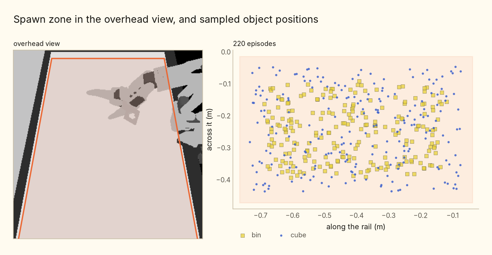

The task is considered successful if all of the following hold: the cube settles inside the bin, the cube and the robot are both static, and the robot touches neither the cube nor the bin. Episodes are capped at 200 steps, each step one action. The robot is controlled at 10 Hz, so each episode has 20 seconds.

The simulator we use is [ManiSkill3](https://arxiv.org/abs/2410.00425) ([repo](https://github.com/haosulab/ManiSkill)) from [Sapien](https://github.com/haosulab/SAPIEN). It is a popular framework with state of the art visual rendering, which is why I picked it, as we want to focus on visual learning instead of the state-based learning mostly used in locomotion. Furthermore, ManiSkill's author has an [official implementation for sim2real on the so101](https://github.com/StoneT2000/lerobot-sim2real) which is of great reference.

# Formalizing the problem

This part can be hard for some readers, as I'll formalize the RL environment mathematically as a Markov Decision Process. If you don't know what that is, I recommend watching [this video](https://www.youtube.com/watch?v=KZeIEiBrT_w), as well as reading up on [Spinning Up](https://spinningup.openai.com/en/latest/) from OpenAI.

I like formalizing as it's easier for me to explain, aka it has the highest information density.

If you have learned about MDP, our problem is a POMDP, a partially observable Markov decision process. The agent never sees the true state (object poses, physics parameters), only what the sensors let through. This includes the two camera frames, plus 14 proprioceptive joint states:

$$o_t = \Big(\phi(\mathbf{X}_t),\ \big[\tilde{\mathbf{q}}_t,\ \mathbf{q}^{\text{tgt}}_t\big]\Big)$$

*φ* is the encoder's preprocessing, and the choice of it is most of this article.

*q̃* is the 7 measured joint positions, carrying gaussian noise at *σ* = 5° per joint to model real encoders.

The second half of that vector is the running controller target. The controller is positional, but command actions are not instantaneous, so *q̃* alone is ambiguous, so we need to model control delay as well, especially since our action space is delta.

The action is a normalized delta, integrated into that target and clipped to the joint limits:

$$\mathbf{q}^{\text{tgt}}_{t+1} = \mathrm{clip}\!\big(\mathbf{q}^{\text{tgt}}_t + \mathbf{a}_t \odot \boldsymbol{\Delta}_{\max},\ \mathbf{q}_{\text{lo}},\ \mathbf{q}_{\text{hi}}\big), \qquad \mathbf{a}_t \in [-1,1]^7$$

So an action of +1 moves that joint's target by its full step.

### The reward

The reward is a staircase over five mutually exclusive stages. Each stage has a fixed rung, plus at most a bounded amount of shaping on top, and the rungs are spaced so that a stage's maximum still sits below the next stage's rung, which means a higher stage always overrides the one below it instead of adding to it.

First we define a few states of the system for the sake of simplifying the reward function:

- *G*: the cube is grasped, both jaws in contact and closing on it
- *B*: the cube is horizontally inside the bin's 96 mm opening, within 48 mm of the bin centre in both axes
- *T*: the robot is touching the cube
- *I*: the cube is _in_ the bin, so *B* and its lowest corner within 5 mm of the bin floor
- *Σ*: success, which is

$$\Sigma = \mathrm{I} \;\wedge\; \|\dot p_{\text{item}}\| \leq 0.02 \;\wedge\; \neg\mathrm{T} \;\wedge\; \text{robot static} \;\wedge\; \neg\text{touching the bin}$$

And the distances: the horizontal and vertical gaps from the tool centre to the cube, the cube's distance to the drop point *g*, and *o* from 0 to 1 for how far the jaw is open.

| stage | condition | reward |
| --- | --- | --- |
| **Rung A**, reach | otherwise | reach shaping, 0 to 1.5 |
| **Rung B**, grasped | grasped, not yet over the bin | 2 + carry shaping, so 2 to 3 |
| **Rung C**, holding over the bin | over the bin, still touching | 4 + jaw openness, so 4 to 5 |
| **Rung D**, released over the bin | over the bin, not touching | 6, flat |
| **Rung E**, success | *Σ* | 10, terminal |

$$r_{\text{reach}} = \underbrace{0.5\big(1 - \tanh(5\,d_{xy})\big)}_{\text{align over the cube}} \;+\; \mathbb{1}[\,d_{xy} < 0.03\,]\underbrace{0.5\big(1 - \tanh(5\,d_z)\big)}_{\text{then descend}} \;+\; \mathbb{1}[\,d_{xy} < 0.03 \,\wedge\, d_z < 0.02\,]\underbrace{0.5\,(1 - o)}_{\text{then close}}$$

The per-step reward is normalized by the maximum, and what the policy maximizes is the discounted sum of that over the episode:

$$\hat r_t = \frac{r_t}{10}, \qquad \max_\pi\ \mathbb{E}_\pi\Big[\textstyle\sum_t \gamma^t \hat r_t\Big], \qquad \gamma = 0.9$$

So the ladder is a rate, not a score for finishing: more steps spent on a higher rung is worth more.

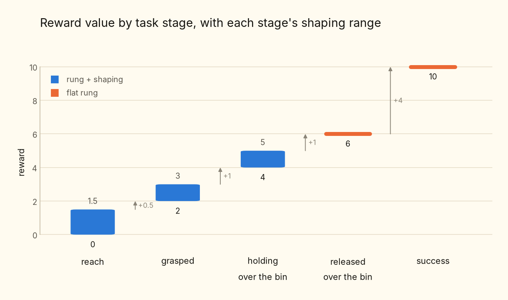

**Rung D** and **Rung E** are easy to conflate. **Rung D** fires the instant the jaw stops touching a cube that is over the opening, and says nothing about where that cube ends up: it can still be in the air, it can catch the rim and bounce out, and the arm can be leaning on the bin throughout. **Rung E** needs the outcome, cube down on the floor and slow, arm stopped, robot touching neither. So **Rung D** is the decision to let go, **Rung E** is that decision having worked, which is why **Rung D** is flat: nothing left to shape, the only way up is for the throw to land.

The ordering replaces a pile of bonuses and hover taxes. "let go, don't hover" is 5 < 6, and regression handles itself, since dropping the cube falls to a lower rung with no penalty needed.

The two jaw terms are mirror images and took longest to get right. Opening pays in **Rung C**, so a jaw opening over the bin climbs toward **Rung D** instead of leaping a plateau; closing pays at the top of **Rung A**, but only with the tool on the cube in both axes. Both are capped below the next rung, so a jaw shutting on nothing loses to a grasp, and the most open still-holding pose loses to a release. An earlier version made the gripper binary to force a clean release, which was treating a reward problem as an action-space problem.

No penalty terms anywhere: speed is capped by the action space and torque by the servos' stall.

The drop point *g* sits 5 cm above the rim rather than on the floor. The opening is 96 mm and the jaw cannot swing open at depth inside it, so shaping toward a deep insert teaches the policy into being unable to let go. Aiming high leaves the last few centimetres to gravity.

# Matching sim2real

A policy trained inside one simulator ends up learning that simulator, its exact lighting and its exact frictions and its exact camera pose, so the moment I drop it onto the real rig all of those are slightly wrong at once and it falls apart.

There are two halves to closing that gap and I find it worth keeping them apart in my head. The first is alignment, where I make the simulator agree with the one real rig I actually own, so that the distribution the policy trains in is centred on the robot it will end up driving. The second is randomization, where I vary everything that changes from one run of that rig to the next, so the policy never comes to depend on any single draw of it.

## Real alignment to sim

Calibrating the cameras turned out to be the easy half, which honestly surprised me. Because the camera holders are part of the so-frame URDF, the simulated camera already sits exactly where the real one is bolted and its pose falls out of forward kinematics, so I never had to measure an offset or fit a pose by hand. The only thing left standing between the two views is the lens.

That lens is a cheap 120° wide-angle module with real barrel distortion, while the simulator renders a clean pinhole, and the two end up seeing quite different fractions of the same scene. Rather than teach the renderer to imitate a cheap lens I went the other way and rectified reality into the simulator's geometry, which is really just undistorting with a *k₁/k₂* plus focal model, rotating (the overhead camera is mounted sideways), zooming and cropping down to the field of view sim renders, and then correcting the colour with a per-channel gain and a gamma.

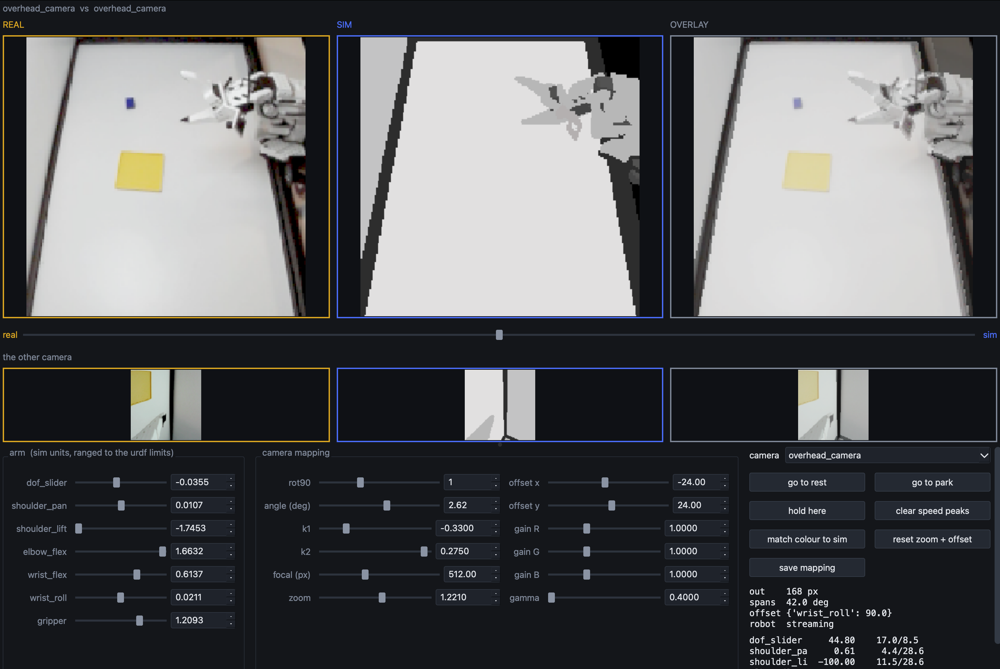

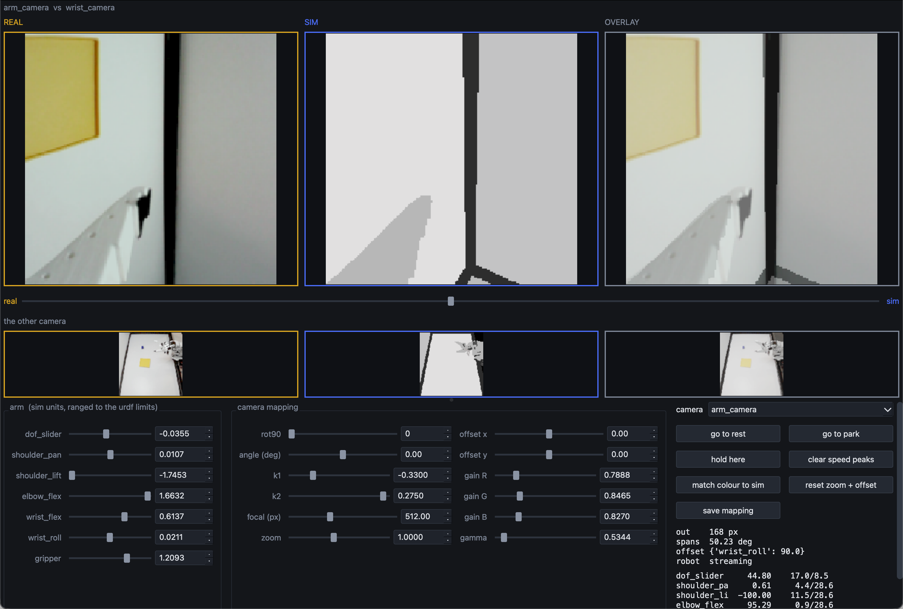

I fit those parameters in a tool that drives the arm while rendering the sim cameras live beside the rectified real feed, with a blend slider between them so I can watch the two converge as I turn each knob, and it writes out the same mapping file the deploy loop later replays, which means the frame the policy trains on and the frame it sees on the robot are formed by an identical transform. Driving the arm while fitting is the part I would not skip, because the wrist camera sees almost nothing except its own jaws, and a fit that looks perfect at one pose can be badly wrong at the next.

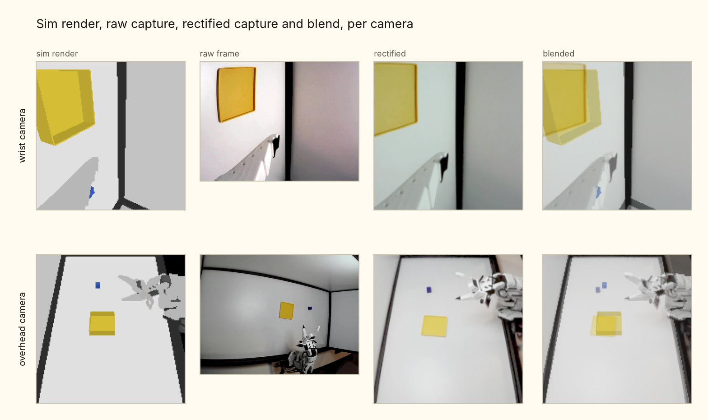

## Domain randomize

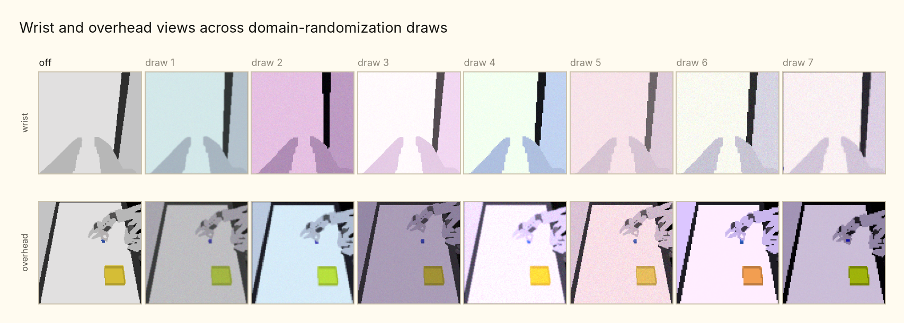

| randomization       | range                                                                  |
| ------------------- | ---------------------------------------------------------------------- |
| ambient lighting    | 0.2 to 0.5 per channel                                                 |
| camera pose and FOV | ±2 mm, ±1°, ±1°                                                        |
| gripper gains       | stiffness 500 to 2000, damping 50 to 200                               |
| arm and rail gains  | stiffness 600 to 1400, damping 60 to 140                               |
| proprio noise       | 5° std on joint reads                                                  |
| cube friction       | 0.5 to 1.0                                                             |
| colour jitter       | brightness/contrast/saturation 0.3, hue 0.05, per camera               |
| sensor realism      | gamma 0.7 to 1.4, ±10% white balance, noise, blur, a compression proxy |

Camera pose and FOV are drawn once when the scene is built rather than every episode, since those are properties of a rig and not of a moment.

The one thing I deliberately leave alone is the colour of the task objects. Randomizing it costs real sample efficiency, and there is exactly one physical rig whose cube and bin are a known blue and a known yellow, so I match them instead and let the policy treat colour as a cue it can rely on. How heavily a given encoder ends up leaning on that cue turns out to matter enormously, which is where the rest of this article goes.

# Improving upon prior work

With our environment defined mathematically, we'll need to worry about how do we train our policy: this means we'll have to pick our RL method, would it be value based, or policy gradient, or would it be both?

### 1. Squint

This leads us to [Squint](https://arxiv.org/abs/2602.21203), which is a zero shot sim2real method on the SO101 published in February this year.

Thanks to [pratham](https://x.com/PrathamJainAI/status/2076232338447724623) for introducing me to this method on his Twitter thread and sharing his Squint notes with me.

The answer to the question above is both. Squint is a visual [Soft Actor-Critic](https://arxiv.org/abs/1801.01290), off-policy and entropy-regularized, so parallel simulation can fill a replay buffer fast while a learned critic squeezes many gradient updates out of every environment step. Instead of the plain discounted return it maximizes return plus an entropy bonus,

$$\pi^\star = \arg\max_\pi\ \mathbb{E}_\pi\!\Big[\textstyle\sum_t \gamma^t\big(r_t + \alpha\,\mathcal{H}(\pi(\cdot\mid o_t))\big)\Big], \qquad \gamma = 0.9$$

Which pays the policy to stay stochastic rather than collapse onto the first behavior that scores. The temperature *α* is auto-tuned so exploration fades on its own, and at deploy the actor is deterministic.

There are three networks. A small conv stack over the two cameras stacked to H×W×6. an MLP actor that fuses the visual features with proprio. And a [distributional critic](https://arxiv.org/abs/1707.06887): instead of a scalar Q-value each critic predicts a distribution over returns across 101 atoms spanning −20 to 20, evenly spaced candidate returns with a probability on each. The Bellman target shifts every atom by *r* + *γz*, projects it back onto the fixed grid, and the loss is a cross-entropy over a two-network ensemble. For a staged reward like ours this is much more stable than scalar Q-learning.

Then the trick it is named for. The cameras render at 128×128 and are area-downsampled to 32×32 before the network sees them. The policy squints. This beats rendering natively at 32 because a native 32 px render point-samples the scene, so a small object flickers or vanishes between frames, while averaging a 4×4 block leaves a stable soft signal. And it is fast, a full run in well under two hours on one GPU.

But look at what squinting costs on this task.

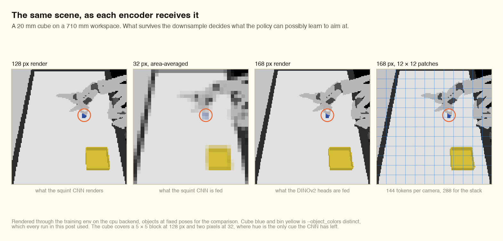

The cube is 20 mm on a 710 mm workspace. It covers a 5×5 block of the 128 px render, and **two pixels** of the 32 px squint. No shape, no edges, no orientation. The only property that survives is hue, which is why every run here paints the cube blue and the bin yellow instead of the black they are by default. At 32 px, colour is the only cue the CNN has.

Squint did not have good performance in sim, as mentioned in training section below, and had no transfer to real.

### 2. DINOv2 encoder

Squint has a problem when going to higher resolution, which is that it focuses too much on unwanted visual artifacts such as shadows and wires. A CNN trained purely inside a simulator has never seen the real world, so it has no prior for what is signal and what is a rendering artifact. To improve upon this, I then switched the from-scratch CNN encoder for a [DINOv2](https://arxiv.org/abs/2304.07193) pre-trained encoder, ViT-S/14 [with registers](https://arxiv.org/abs/2309.16588), trained self-supervised on real images at scale.

It stays frozen on purpose. Fine-tuning it on sim renders would just re-teach it the simulator's quirks and throw away the prior that motivated the swap.

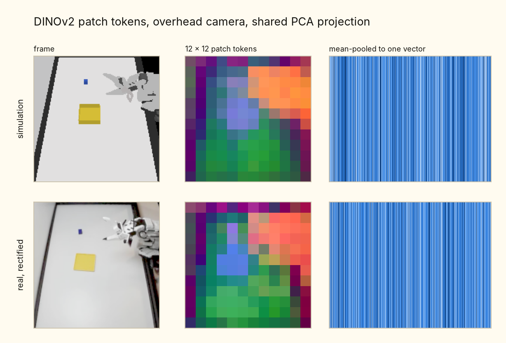

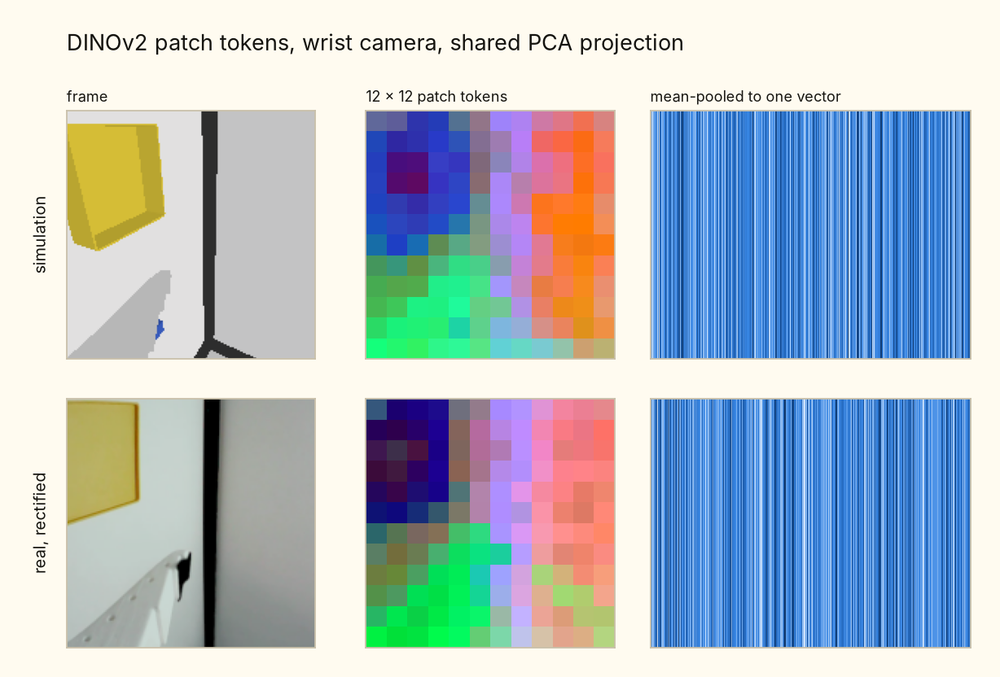

The middle column is the reason to bother. The same frozen backbone on a sim render and on a rectified real frame, both painted by a single shared PCA so the colours are comparable rather than each image being flattered by its own projection. The surface, the arm and the frame edges take the same colours in both worlds, and we did not have to train for it.

The mistake to avoid is treating DINOv2 like a CNN, flattening its output into one vector and moving on. It does not hand you a feature image, it hands you tokens. At 168 px, twelve of its 14-pixel patches a side, each camera is a 12×12 grid of 384-dim patch tokens, 288 for the pair. So the head consumes tokens: both grids go in jointly with a learned per-camera embedding, self-attention runs over the sequence, and a learned readout token collects the answer. This follows the [Patch Policy](https://arxiv.org/abs/2607.18236) recipe, whose claim is exactly that dense representations are what embodied control needs.

To test the performance of using Patch Policy, I trained a control policy, `dino_global` is the same frozen backbone at the same resolution with the same head width and update ratio, differing in one thing: the patch grid is collapsed to one vector per camera before the head sees it, using either the CLS token or the mean over patches. The performance can be seen below.

In simulation, `dino_patch_policy` yield the highest performance. In real life, it was the only policy that actually transfers reliably.

# Training notes

Training is 12M environment steps on a single RTX PRO 6000, replay retention of 2 episodes per env, batch 512, and Squint's hyperparameters mostly untouched. The Squint CNN runs 1024 parallel envs at 2833 environment steps per second and finishes in about ninety minutes. The DINO heads run 512 envs, and the patch head is the expensive one at 341 steps per second and ten hours.

We have four encoders, same task, same reward, same retention, same budget.

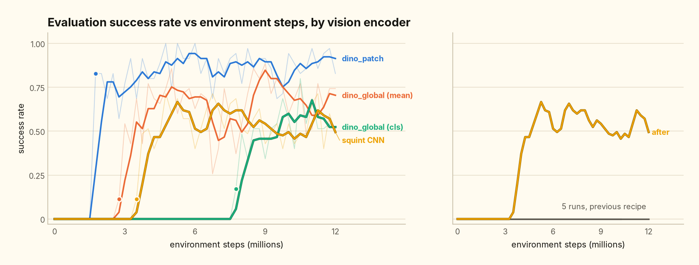

| encoder                    | first success | best     | sustained |
| -------------------------- | ------------- | -------- | --------- |
| `dino_patch`, 12×12 grid   | 1.75M         | **1.00** | **0.88**  |
| `dino_global`, mean-pooled | 2.75M         | 0.89     | 0.67      |
| `dino_global`, CLS token   | 7.75M         | 0.80     | 0.58      |
| `squint` CNN at 32 px      | 3.50M         | 0.71     | 0.52      |

The dense grid wins on both axes. It blooms first and holds the highest level once it is there. Collapsing the same features to one vector per camera costs about twenty points of sustained success, and collapsing to the CLS token costs another nine and delays the bloom by five million steps. The only difference between the top row and the middle two is whether the patch grid survives to the head.

Two things about the shape of those curves.

The long flat stretch before the bloom is the reward ladder doing what it is built to do. Reaching and grasping are densely shaped, so the return climbs from the first thousand steps, but success is terminal and conjunctive: the cube has to be in the bin, slow, with the arm stopped and touching nothing, all inside 200 steps. None of that pays partial credit. So the policy spends millions of steps getting better at **Rung A** through **Rung C** with the metric pinned at exactly zero, and the moment opening the jaw over the bin starts paying, placements arrive in bulk rather than one at a time. That is why the bloom is a step rather than a ramp, and why the return is the leading indicator you should watch instead.

The ceiling is not 1.0 because evaluation runs with the full randomization on. Every episode draws its own lighting, PD gains, camera pose and FOV, joint-read noise and sensor augmentation, and some of those draws are simply harder than others. The strict success condition costs a few more: a placement that lands the cube but ends with the arm still drifting, or a finger resting on the rim, scores nothing at all despite looking finished. And on a 20 mm cube there is not much margin in the grasp, so a miss usually eats enough of the 200 steps that the episode cannot recover. `dino_patch` sitting around 0.88 with peaks at 1.00 is what a policy that basically works looks like under those conditions.

# Deployment

My so-frame is built to be a remote rig and so I always connect to it remotely through [LiveKit Portal](https://github.com/livekit/portal).

In this setup, the robot acts as a participant connecting to the policy (also as a participant) through a LiveKit room.

The robot exposes its controls while sending raw camera frames to the policy. On the policy side, a simple bridge is written to rectify reality to simulation constraints. Sending raw frames is deliberate: the human watching the web UI gets the full wide-angle view, and the policy privately reconstructs its narrow 168 px version before every inference.

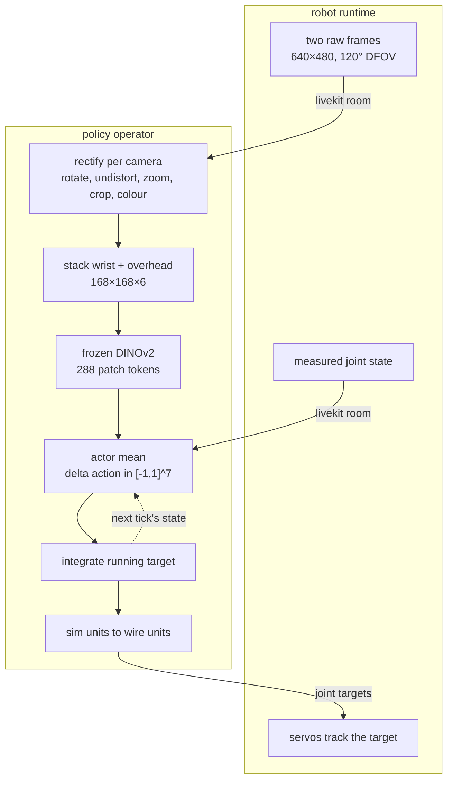

The bridge itself is thin, so the network's tensors never leave sim space: radians to degrees for the arm, metres to a normalized 0-to-100 position for the rail. One joint, `wrist_roll`, carries a measured 90° offset because its calibrated zero is not the URDF zero. Everything else is identity, checked against a live arm rather than assumed.

<video src="blog-viz/assets/deploy_policy.mp4" controls muted loop playsinline width="100%"></video>

That is the policy visualization window during a real rollout: the two rectified views the encoder is fed on the left, and a bar per joint on the right for the action it was given and how far it lags its target, red once a joint is over its own gate.

# Takeaway

Some learnings as of now:

- There is nothing I can do in sim to reliably compensate for how crap the STS3215 response is. It just sucks. I can throw a bunch of domain randomization at it, but for the love of god, I don't want to do it like that.
- Pretrained models help generalization and improve sample efficiency (u can say duh Sherlock). In my case, only my DINO backbone models transfer to the real world, so it holds some weight, or I can say damn, maybe I'm stupid with doing Squint.
- Patch Policy greatly improves policy performance. Global mean and CLS token cannot compare, in sim or in real. I spent a good amount of time trying to figure out a way there, then [the paper dropped out of nowhere](https://x.com/jeffacce/status/2080017577749684718?s=20) and I was like this is it. God level timing.
- Visual is one thing, matching control behaviors and system delay is a whole other problem set, which I have not solved.

This is just a simple proof of concept (which is reliable and reproducible), it took me 1 week for the RL env and another to continously solve new problems until success. Imagine what others can do with more time and more budget.
