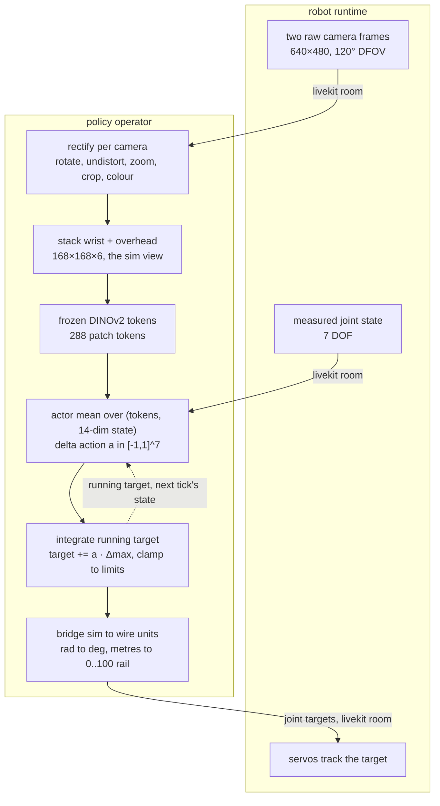

# making zero-shot sim2real possible on so-frame

for the past months, we've been designing a cheap robot rig for benchmarking our transport at livekit, called so-frame.

our benchmarking focus so far has been on training behavior cloning models and collecting data for them. but after hours of teleoperating the arm for the hundredth episode, one question kept coming back to me: "can't the robot just self-learn these behaviors?"

after all, we are doing very simple tasks, picking and placing objects in a very controlled environment.

so when we released so-frame to the world, we also designed and released its digital twin, with the vision of training an rl model that reduces our need to collect data on the rig, be it rl from scratch or rl from prior demonstrations.

the aim is very simple: make sim2real work end to end, the same way our bc policies work, purely from visual and proprioceptive states. zero-shot means the policy is trained entirely in simulation and dropped onto the real robot with no fine-tuning, no real-world data, no calibration episodes. the first time the network ever sees a real camera frame, it has to drive the arm through the whole task.

today, we got it to transfer zero-shot, and this is a write-up on how we did it.

the short version of what we learned: the simulator, the reward and the deploy loop all had to be right, but none of them was the thing that finally decided it. the encoder was. four vision encoders learned this task in simulation, and only one of them survived contact with the real robot.

<!-- IMG 1 (hero): side-by-side clip, sim rollout | real rollout, same task. NEEDS: a fresh capture, see blog-viz/README.md. -->

> _hero clip pending: a matched sim and real rollout of the current cube task._

# what is the environment?

the so-frame's full description can be found [here](#).

in short, the robot is an SO-101 5-DOF arm mounted on a linear rail, giving 7 actuated DOF total:

- `dof_slider`, the rail (linear travel along the work surface)
- `shoulder_pan`, `shoulder_lift`, `elbow_flex`, `wrist_flex`, `wrist_roll`, the arm
- `gripper`, a parallel jaw

the arm and rail are bolted to a frame with a diffuse lightbox work surface (near-white, evenly lit). two cameras are rigidly mounted via printed holders:

- a wrist camera that follows the gripper, used for fine grasp alignment
- a static overhead camera that sees the whole work surface, used to localize the objects

both are cheap innoMaker USB modules with a 120° diagonal field of view, and their exact specifications don't matter for reproduction, because we built a tool that aligns the simulation cameras to whatever real cameras you have. more on that later.

the entire frame, arm, rail, cameras, and lightbox panels are one URDF. the simulated twin and the real rig share the same kinematics and the same camera mounts: both sim cameras are mounted directly on their URDF camera links, so their poses come out of forward kinematics rather than from hand-measured offsets that have to be maintained separately. this one decision quietly does a lot of the sim2real work for us.

# what is the task?

pick up a 20 mm cube and place it in a bin.

- the cube: a 20 mm cube, about 3.2 g, blue.
- the bin: 100 mm square, 30 mm tall, 2 mm walls, so a 96 mm opening 28 mm deep. yellow.

both come from the same CAD the physical objects were printed from, and the converter that exports the meshes also asserts their dimensions against the constants the environment uses, so editing the CAD without updating the task fails loudly instead of quietly changing what the robot is doing.

the cube and the bin spawn anywhere in one zone, 258 × 710 mm, with a random yaw each. the bin is placed first, then the cube is rejection-sampled until its footprint clears the bin's by at least 50 mm. the zone is not a design choice so much as a measurement: it is the intersection of where the arm can reach with a top-down grasp, what the overhead camera can actually see, and where the bin physically settles on the panels. the policy is vision-only, so anything outside the camera's footprint is not hard to learn, it is unlearnable.

the zone is much longer along the rail (710 mm) than across it (258 mm), which is the point: most spawns put the cube and the bin far enough apart that the arm cannot reach both without driving the rail. the extra DOF has to be used rather than ignored.

an episode succeeds only if the cube has settled in the bin, the cube and the robot are both static, and the robot is touching neither the cube nor the bin. this is deliberately strict. hovering the cube over the bin forever does not count, and neither does dropping it in and then leaning on the rim.

episodes are capped at 200 steps at 10 Hz control, so 20 seconds per attempt. that budget is sized against rail travel, which dominates everything else: park to cube then cube to bin costs about 110 steps at a spawn near the far end, which leaves the worst tenth of episodes a little under half their time to descend, grasp, lift, release and settle.

the simulator is [ManiSkill3](https://github.com/haosulab/ManiSkill), built on SAPIEN. i picked it for two reasons. first, it has state-of-the-art visual rendering with massively parallel GPU simulation, and we want to learn from pixels, not from the privileged state vectors most locomotion work trains on. second, ManiSkill's author has an official sim2real implementation for the SO-101, which was a great reference to build on.

# formalizing the problem

this part can be dense if you haven't seen rl notation before. i'll formalize the environment mathematically as a Markov Decision Process; if that term is new to you, i recommend [this video](#) and OpenAI's [rl cheat sheet](#).

an MDP is the tuple $(\mathcal{S}, \mathcal{A}, P, r, \gamma, \rho_0)$: a state space $\mathcal{S}$ (every configuration the world can be in), an action space $\mathcal{A}$ (everything the agent can do), a transition kernel $P(s_{t+1}\mid s_t, a_t)$ (the physics: how likely the world is to land in state $s_{t+1}$ after taking action $a_t$ in state $s_t$), a reward $r(s_t, a_t)$ (a score for that step), a discount $\gamma \in (0,1)$ (how much tomorrow's reward is worth relative to today's), and an initial-state distribution $\rho_0$ (where episodes start). the goal is a policy $\pi$ maximizing the expected discounted return $\mathbb{E}_\pi[\sum_t \gamma^t r_t]$: the total score over an episode, later rewards shrunk by $\gamma$ each step, averaged over everything that can happen.

our setting is really a **POMDP**, a _partially observable_ MDP: the agent never sees the true state $s_t$ (object poses, physics parameters). it sees an _observation_ $o_t = O(s_t)$, where $O$ is the emission function, i.e. whatever the sensors let through.

### state, observation, action

the hidden state $s_t$ holds all joint positions and velocities, the cube and bin poses, and the per-episode randomized physics (frictions, controller gains). the observation the policy consumes is vision plus noisy proprioception:

$$o_t = \Big(\phi(\mathbf{X}_t),\ \big[\tilde{\mathbf{q}}_t,\ \mathbf{q}^{\text{tgt}}_t\big]\Big), \qquad \big[\tilde{\mathbf{q}}_t, \mathbf{q}^{\text{tgt}}_t\big] \in \mathbb{R}^{14}$$

reading the symbols left to right: $\mathbf{X}_t$ is the raw pixels, the wrist and overhead RGB frames stacked on the channel axis into one square, 6-channel image. $\phi$ is whatever that encoder does to them before the policy sees them, and it differs per architecture, which turns out to be the whole story of this post.

$\tilde{\mathbf{q}}_t$ is the 7 measured joint positions, the tilde marking them as noisy measurements rather than ground truth, corrupted to model real encoders:

$$\tilde{\mathbf{q}}_t = \mathbf{q}_t + \epsilon_t, \qquad \epsilon_t \sim \mathcal{N}(0, \sigma_q^2 I), \quad \sigma_q = 5^\circ$$

where $\mathbf{q}_t$ is the true joint position and $\epsilon_t$ is gaussian noise with a standard deviation $\sigma_q$ of 5 degrees per joint.

$\mathbf{q}^{\text{tgt}}_t$ is the running controller target, and it's the reason the proprio vector is 14-dim instead of 7. the low-level controller is positional, always chasing wherever the target currently sits, and the arm physically lags behind it: two identical arm poses with different targets will evolve completely differently over the next few steps, so the measured pose alone is ambiguous and the problem stops being Markov. the policy is told both where the arm _is_ and where it was last _told to go_. at deploy time, the inference loop maintains this exact same integrated target and sends it to the servos, so the semantics carry over one to one.

this layout is not just a convention, it is a contract. the 14 fields and their order are measured off the live training environment and written into the checkpoint, and deploy assembles its vector from that record rather than assuming a width. a checkpoint that expects something else fails at load instead of quietly driving the arm from a scrambled state.

the action is a normalized delta, integrated into that running target and clipped to the joint limits:

$$\mathbf{a}_t \in [-1,1]^7, \qquad \mathbf{q}^{\text{tgt}}_{t+1} = \mathrm{clip}\!\big(\mathbf{q}^{\text{tgt}}_t + \mathbf{a}_t \odot \boldsymbol{\Delta}_{\max},\ \mathbf{q}_{\text{lo}},\ \mathbf{q}_{\text{hi}}\big)$$

$\mathbf{a}_t$ is one number per joint in $[-1, 1]$. $\boldsymbol{\Delta}_{\max}$ is the per-joint maximum step size, and $\odot$ multiplies the two element-wise, so an action of $+1$ moves that joint's target by its full step and $0$ holds it still. $\mathrm{clip}$ pins the result between the joint limits so no command can run past a joint stop. a PD controller tracks $\mathbf{q}^{\text{tgt}}$ at 100 Hz while actions arrive at 10 Hz.

the gripper is continuous, and stays continuous all the way to the robot. an earlier version of this work thresholded it to fully open or fully closed, on the theory that "release" should be unambiguous. that turned out to be treating a reward problem as an action-space problem: once both jaw motions were shaped properly (below), the policy learned to commit to opening and closing on its own, and the binary hack came out.

because an action is a delta per control period, it is really a velocity, and that reading matters later when the same number has to mean something on hardware that cannot move as fast as it is told.

### reward

the reward is a **monotonic staircase**. each stage is a fixed rung plus at most a bounded amount of shaping, and the rungs are spaced so that a stage's maximum stays strictly below the next stage's floor. a higher stage overrides the lower one, it never sums with it:

$$\text{reach } [0, 1.5] \;<\; \text{grasped } [2, 3] \;<\; \text{holding } [4, 5] \;<\; \text{released } 6 \;<\; \text{success } 10$$

reading it the way the policy climbs it: reaching pays up to 1.5, a grasp jumps the floor to 2, getting the cube over the bin reaches 4, letting go jumps to 6, and success is a flat 10. the ordering does the work that a tangle of bonuses and hover taxes used to do. "let go of the cube, don't just hold it over the bin" is encoded once, by the fact that $5 < 6$: holding is a plateau you can only beat by releasing. and because the ladder is monotonic, regression is handled for free. drop the cube back on the surface and you fall to a lower rung automatically, so there is no anti-regression penalty to tune.

within the stages, three shaping terms:

$$r_{\text{reach}} = \underbrace{0.5\big(1 - \tanh(5\,d_{xy})\big)}_{\text{align over the cube}}\ +\ \mathbb{1}[\,d_{xy} < 0.03\,]\,\underbrace{0.5\big(1 - \tanh(5\,d_z)\big)}_{\text{then descend}}\ +\ \mathbb{1}[\text{on the cube}]\,\underbrace{0.5\,(1 - o_{\text{grip}})}_{\text{then close}}$$

$$r_{\text{carry}} = 1 - \tanh(5\,\|g - p_{\text{item}}\|), \qquad r_{\text{hold}} = 1.0 \cdot o_{\text{grip}}$$

the $1 - \tanh(c \cdot d)$ shape is the workhorse: it turns a distance $d$ into a reward that is 1 at zero distance and decays smoothly toward 0. the reach term is **top-down**: it always pays for closing the horizontal gap $d_{xy}$, but the vertical term only switches on once the tool is within 3 cm of the cube horizontally, so the policy is rewarded to get _over_ the cube and drop onto it rather than scooping in from the side, which wrecked the grasp on the real rig. $r_{\text{carry}}$ pays for closing the distance to the drop point once holding. $o_{\text{grip}} \in [0,1]$ is how far the jaw is open.

the two jaw terms are the piece that took longest to get right, and they are mirror images. **opening** pays inside the holding stage, so a jaw that opens over the bin climbs continuously toward the released rung instead of having to leap a flat plateau. **closing** pays at the top of the reach stage, but only while the tool is genuinely on the cube, aligned in xy _and_ within 2 cm in z. each is capped below the next rung, so a jaw that shuts on nothing is still worth less than a real grasp, and the most-open still-holding pose is still worth less than an actual release. with those two ramps in place the gripper never has to make a blind jump in either direction.

there are **no penalty terms at all**. every limit that used to be a penalty is now structural: per-step speed is capped by the delta action space, and torque by the servos' stall value. there is nothing to trade off against the task.

the last non-obvious piece is the drop point. the carry term aims at a point 5 cm above the bin **rim**, not at the bin floor. the interior is 96 mm and the jaw cannot swing open at depth inside it, so a policy shaped to insert deep becomes physically unable to let go. aiming above the rim lets the jaw open freely, gives the real arm margin to clear the wall, and lets gravity finish the placement. success still requires the cube to actually be in the bin.

# randomizing the environment

before we go on to what rl method we use, i'd like to introduce domain randomization.

the core problem of sim2real is that a policy trained in one simulator learns that simulator's quirks: its exact lighting, its exact friction, its exact camera pose. reality is then a distribution shift, and the policy shatters. domain randomization is the standard fix: instead of training in one simulation, you train across a whole distribution of simulations, resampling physical and visual parameters. if the distribution is wide enough, reality is just one more sample from it.

the way i think about it, the sim2real gap splits into two jobs: **appearance matching** (make sim look like the one real rig, which gets its own section next) and **robustness** (be invariant to the ways the real rig differs from run to run). domain randomization is the robustness half.

| randomization | range | why |
| --- | --- | --- |
| ambient lighting | 0.2 to 0.5 per channel | real lightbox brightness varies, don't key on exact luminance |
| camera pose | ±2 mm, ±1° | printed mounts flex, calibration is never pixel-perfect |
| camera FOV | ±1° | same |
| gripper gains | stiffness 500 to 2000, damping 50 to 200 | the real servo runs its own controller, don't overfit sim's PD |
| arm and rail gains | stiffness 600 to 1400, damping 60 to 140 | same, for the STS3215 servos |
| proprio noise | 5° std on joint reads | real encoders are noisy |
| cube friction | 0.5 to 1.0 | grasping can't depend on exact friction |
| colour jitter | brightness/contrast/saturation 0.3, hue 0.05, per camera | exposure and white balance drift |
| sensor realism | gamma 0.7 to 1.4, ±10% per-channel white balance, gaussian noise, occasional blur and a blocking proxy | closes the clean-render vs cheap-USB-camera gap |

camera pose and FOV are drawn when the scene is built rather than every episode, because they are properties of a rig rather than of a moment. everything else resamples per episode.

one thing deliberately left off: **colour randomization of the task objects**. it costs a lot of sample efficiency, and the single real rig has fixed, known colours. so we match instead of randomize, and the policy gets to use colour as a reliable cue instead of spending capacity becoming invariant to it. as it turns out, exactly how much a policy leans on that cue is one of the things that separates the encoders.

# matching simulation to real

domain randomization widens the distribution; this section is about centering it on the real rig. everything systematic about _this_ rig gets matched at the source rather than papered over with filters.

**colours.** the cube is blue and the bin yellow, on a near-white work surface, and sim uses linear base colours picked to land on the real ones under sim's own lighting. nothing in the scene is pure black or pure white, deliberately: a pure black object returns no light and renders as a flat silhouette with no shape cues, and a pure white one clips under the softbox and loses its edges the same way. real matte black plastic reflects four or five percent anyway.

**lighting.** the raster lighting is a stand-in for the real diffuse lightbox: boosted omnidirectional ambient plus shadowless fill. the shadow-casting key light is **off**. it used to be on, faintly, but the real lightbox produces essentially no directional shadow, only soft contact darkening at an object's base, so a cast shadow in sim was a sim-only artifact for the policy to key on. turning it off narrowed the gap and saved a whole geometry pass per camera per step at the same time, which is the rare change that is free in both directions.

**camera calibration.** the real cameras are heavily wide-angle with real barrel distortion. you cannot just set the sim camera's FOV to the lens spec: the sim's pinhole render and the real fisheye see different fractions of the scene. so instead of making sim render like a cheap wide-angle lens, we do the opposite and rectify reality into the sim's geometry: undistort with a $k_1/k_2$ plus focal-length model, rotate (the overhead camera is mounted sideways), then zoom and crop to the region matching the sim's rendered FOV, then correct colour with a per-channel gain and a gamma.

those parameters come from an interactive tool that drives the real arm and renders the sim cameras live, side by side with the rectified real feed, with a blend slider between them. every knob is both a slider and a spin box over the same number, so you can drag to search and then type to land exactly. crucially, the mapping it writes is the same file the deploy loop replays, so the frame the policy trained on and the frame it sees on the robot are formed by an identical transform.

driving the arm while fitting is not a convenience, it is the requirement. the wrist camera's view is almost entirely jaws, so a fit checked at one arm pose tells you nothing about whether it holds as the arm moves. an earlier two-step flow, capture a frame then align against it offline, could only ever validate a single pose.

the figure above is the check rather than the claim: the sim there is rendered at the exact joint pose the real frames were captured at, and the cube and bin are stood at positions read back out of the rectified real frame by un-projecting them onto the work surface. that the arm, the cube, the bin and the frame extrusions then land on top of each other is what says the mapping is right. it also shows the one place it is looser: the overhead camera's field of view was fitted against the rig, and the wrist's is inherited from the MJCF twin, so the wrist's objects sit a little large.

there is a consistency bonus hiding here too. the real pipeline captures at 640×480 and rectifies to the encoder's resolution, the same one sim renders at, so the way a pixel is formed is identical in both worlds.

**speed calibration.** the sim originally let the arm move fast. the real STS3215 servos, especially driving the rail, are much slower, and a policy trained to command motion the hardware can't track produces a target that winds up ahead of the real arm, which then overshoots and oscillates. so the real robot's achieved speeds were measured directly, by driving each joint to its limit in a manual control UI and reading the achieved speed off the observation stream. the arm joints manage 29 to 34 deg/s and the rail about 7 cm/s. the sim's per-step deltas are set from exactly those numbers: 0.05 rad per step for the arm joints, 7 mm per step for the rail, at 10 Hz.

it is worth being clear about which limit is doing the work here, because it is easy to assume it is torque. it isn't. 3 N·m against the servo's damping would reach something like 280 deg/s, an order of magnitude past what the real arm does. the speed limit is what enforces real speed, and it lives in the action space.

**torque limits.** the other half is force. the arm and gripper are Feetech STS3215 servos with a stall torque around 3 N·m, so each joint's force limit in sim is set there. an over-powered sim arm learns to muscle through imprecise grasps and to lean on the work surface, motions that don't transfer since the real servo simply stalls. at the real stall torque the low top-down grasp gets _easier_: a weak arm settles gently onto the cube instead of slamming and bouncing off.

# improving upon prior work

with the environment specified, randomized, and centered on the real rig, the last piece is how to actually train a policy in it.

### 1. squint

this leads us to [Squint](https://arxiv.org/abs/2602.21203) (Almuzairee & Christensen, UC San Diego), a zero-shot sim2real method on the SO-101 published in february this year, targeting the exact same arm in the exact same simulator.

thanks to pratham for introducing me to this method on his twitter thread and for sharing his squint notes with me.

squint is a visual Soft Actor-Critic: off-policy and entropy-regularized, which lets massively parallel GPU simulation fill a replay buffer very fast while a learned critic squeezes many gradient updates out of every environment step.

"entropy-regularized" is the defining choice. rather than the plain discounted return, SAC maximizes the **maximum-entropy** objective, the return plus a bonus for keeping the policy stochastic:

$$\pi^\star = \arg\max_\pi\ \mathbb{E}_\pi\!\Big[\textstyle\sum_t \gamma^t\big(r_t + \alpha\,\mathcal{H}(\pi(\cdot\mid o_t))\big)\Big], \qquad \gamma = 0.9$$

$\mathcal{H}(\pi(\cdot \mid o_t))$ is the entropy of the policy's action distribution, a measure of how random its choices still are, and the temperature $\alpha$ sets how much that randomness is worth relative to reward. paying the policy to stay stochastic keeps it exploring instead of collapsing onto the first behavior that scores, and $\alpha$ is auto-tuned toward a target entropy so exploration fades on its own. at deploy the actor is deterministic, $\mathbf{a}^{\text{eval}}_t = \tanh(\mu_\theta(o_t))$, just the mean of the actor's output distribution squashed into the valid action range.

the pieces:

- **a small CNN encoder.** the two cameras stacked to H×W×6, normalized, through an Atari-style conv stack, flattening to a 1024-dim representation.
- **an MLP actor.** a projection layer fuses vision and proprioception, then a 3-layer MLP outputs a squashed gaussian over actions.
- **a distributional critic ensemble.** instead of predicting a scalar Q-value, each critic predicts a full distribution over returns (C51) across $N = 101$ atoms spanning a fixed support $[v_{\min}, v_{\max}] = [-20, 20]$.

the atoms are evenly spaced candidate return values covering that interval, and the critic outputs a probability for each: "the return from here is probably around 6, maybe 10". the training target applies the Bellman operator to each atom, $\hat{\mathcal{T}} z_i = \mathrm{clip}(r + \gamma z_i, v_{\min}, v_{\max})$, which is one sentence of rl in symbols: the return from now is the reward you just got, plus the discounted return from the next step, clipped back into the support. the shifted distribution is projected back onto the fixed atoms and the loss is a cross-entropy, taking the min over a 2-network ensemble to tame overestimation. this is markedly more stable than scalar Q-learning for a staged reward like ours.

layer norm runs throughout, which is what allows squint's aggressively high update-to-data ratio without the networks blowing up.

and then there's the trick the method is named after: the cameras render at 128×128, and the images are area-downsampled to 32×32 before the network ever sees them. the policy is squinting. two reasons this beats rendering natively at 32. **antialiasing**: a native 32 px render point-samples the scene, so a sub-pixel object flickers or vanishes between frames, whereas averaging a 4×4 block leaves a stable soft signal. and **speed**: at 32×32 the encoder is tiny and a full run finishes in well under two hours on one GPU.

but look at what squinting costs on this particular task.

the cube is 20 mm on a 710 mm workspace. it covers a 5×5 block of the 128 px render and **two pixels** of the 32 px squint. at that size it has no shape left, no edges, no orientation. the only thing that survives is its hue. that is why every run in this post paints the cube blue and the bin yellow rather than the black they are in the repo's default scheme: at 32 px, colour is the only cue the CNN has, and without it the task is not learnable at all.

hold that thought.

### 2. dinov2, dense and collapsed

the alternative is to stop learning the visual features from scratch. a from-scratch CNN trained purely inside a simulator has never seen the real world, so it has no prior for what is signal and what is a rendering artifact, and it will happily latch onto whatever pixels correlate with reward.

so i swapped it for a frozen, pre-trained **DINOv2 encoder** (ViT-S/14 with registers). DINOv2 was trained self-supervised on real images at scale, so its features already carry invariances we would otherwise have to learn from randomization alone. the backbone stays **frozen**: fine-tuning it on sim renders would just re-teach it the simulator's quirks and throw away the prior that motivated the swap. only a head on top sees gradients.

the mistake to avoid is treating DINOv2 like a CNN, flattening its output into one vector and moving on. DINOv2 doesn't hand you a feature image, it hands you a set of tokens. at 168 px, which is 12 of its 14-pixel patches a side, each camera becomes a 12×12 grid of 384-dim patch tokens, 288 for the two-camera stack. so the head consumes tokens: both cameras' grids go in jointly, with a learned per-camera embedding so the head can tell wrist from overhead, self-attention runs over the whole sequence, and a learned readout token collects the answer. this follows the [Patch Policy](#) recipe (Zhou, Cui, Langford, Tan, LeCun, Pinto, 2026), whose claim is exactly that dense visual representations are what embodied control needs.

that middle column is the reason to bother. it is the same frozen backbone run on a sim render and on a rectified real frame, with both painted by a single shared PCA, so the colours are comparable rather than each image being flattered by its own projection. the work surface, the arm and the frame edges take on matching colours across the two worlds, which is the invariance we were hoping to buy and did not have to train for.

that is a claim you can test rather than believe, so i built the control. **`dino_global`** is the same frozen ViT at the same resolution with the same head width and the same update ratio, differing in one respect: the patch grid is collapsed to a single vector per camera before the head sees it, either the CLS token or the mean over patches. 288 tokens against 2. if dense representations are the point, this is where it should show.

one practical note that makes all of this affordable. the backbone is frozen, so its tokens never change for a given frame, which means they can be computed once per environment step in an observation wrapper and cached in the replay buffer, rather than recomputed on every gradient batch. what lands in the buffer is already encoder-ready. the wrapper has to be last in the pipeline, since everything above it needs pixels and it emits features.

# what actually happened

four encoders, same task, same reward, same replay retention, same 12M step budget.

| encoder | first success | best | sustained (last 10 evals) |
| --- | --- | --- | --- |
| `dino_patch`, 12×12 patch grid | 1.75M | **1.00** | **0.88** |
| `dino_global`, mean-pooled | 2.75M | 0.89 | 0.67 |
| `dino_global`, CLS token | 7.75M | 0.80 | 0.58 |
| `squint` CNN at 32 px | 3.50M | 0.71 | 0.52 |

the dense grid wins on both axes that matter. it blooms first, at 1.75M steps against 2.75M and 3.5M, and it holds the highest level once there. collapsing the same frozen features to one vector per camera costs about twenty points of sustained success, and collapsing them to the CLS token specifically costs another nine and delays the bloom by five million steps. the only difference between the top row and the middle two is whether the patch grid survives to the head. that is about as clean as this kind of comparison gets.

the squint CNN, for its part, does learn the task. it is also by far the cheapest: 2833 environment steps per second and a 12M-step run in about an hour and a half, against 341 steps per second and ten hours for the patch head. if all you needed was a number in simulation, it would be a perfectly reasonable trade.

### the recipe mattered more than any of them

the right panel of that figure is the part i'd most want a reader to take away. before the reward ladder gained its jaw-closing ramp and the horizon came down to 200 steps, the same CNN ran five times, three of them separate seeds, for twelve million steps each, and never placed the cube once. not rarely. never.

nothing about the encoder changed between those runs and the one that reached 0.71. what changed was that closing the jaw stopped being a blind leap off a flat plateau, and episodes got short enough that the credit for a placement wasn't diluted across a 300-step horizon.

it is worth saying plainly, because the encoder comparison above is the interesting result and this one is the useful result: i spent a while suspecting the architecture when the reward was the problem.

### two things that look like bugs and are not

**entropy collapse.** the auto-tuned temperature bottoms out around 1e-4 within the first 600k steps in every run, successful or not. it looks alarming and it is normal. printing it with three decimals makes it read as exactly 0.000, which makes it look worse.

**late-training oscillation.** the patch head does not converge to a number, it wanders around one. after peaking at 1.00 at 4.75M it spent the remaining seven million steps between 0.69 and 1.00, finishing at 0.83. the critic is not diverging (its loss stays flat and the max Q sits pinned at the maximum achievable discounted return), it is confidently over-optimistic. an earlier run of the same architecture, before the reward and horizon change, did the far uglier version of this: peak 0.74 at 9M, then 0.34, 0.23, 0.06, and dead flat 0.00 by the end.

the practical consequence is the same in both cases: the final-step evaluation is not the number you want, and the best checkpoint is. every checkpoint deployed here is a `ckpt_best`, and the one driving the robot is from step 6.0M of a 12M run.

and one thing that genuinely is a trap: **a single run is not an experiment.** the CNN has high seed variance, and one seed of the proven configuration once finished at exactly 0.000 while another reached 0.688. eval is 35 episodes, so 0 out of 35 cannot be sampling noise off a working policy. it is a real policy state, and the only defense is running three seeds.

# deployment

my so-frame is built to be a remote rig, so i always connect to it through livekit portal.

the robot and the policy are two participants in a livekit room. the robot runtime drives the real arm and rail, publishes a fused observation every tick (the 7-DOF joint state plus the two raw 640×480 camera frames), and applies the joint targets it receives. the policy operator subscribes, runs inference, and sends targets back. an active-operator gate ensures exactly one controller drives the robot at a time. the two processes can be on the same machine or on opposite sides of the internet.

the robot publishes **raw** frames, not rectified ones, which is a deliberate split: the human watching in the web UI gets the full wide-angle view, and the policy privately reconstructs its narrow, undistorted, colour-corrected 168 px view before every inference.

the sim to real bridge is a deliberately thin unit layer, so the network's tensors never leave sim space: arm and gripper in sim radians to real degrees, and the rail from sim metres to the follower's normalized 0-to-100 position. one joint, `wrist_roll`, carries a measured 90° offset because its calibrated zero is not the URDF zero. everything else is identity, and that is a fact that was checked against the live arm rather than assumed.

### an action is a velocity, and the arm is slow

the single most important thing about running this loop on hardware is the thing i flagged back in the action space: **an action is a delta per control period, which is to say a velocity.** sim integrates one every step. so deploy has to keep applying an action every tick until a new one replaces it. the first version applied each action once and froze the target, and the arm simply stalled between decisions.

the second problem is the mirror image. the sim arm reaches its target within a step and the real arm lags. if the target keeps advancing while the arm is behind, it winds up, and by the time the jaw closes the arm has already sailed past the cube.

the fix is a lag budget. the target only advances while every gated joint is within a few action steps of its measured pose, and the same threshold is the decision gate: a new action is computed once the arm is back inside budget. it is a velocity-clamped ramp rather than a stopwatch. the budget is a real bound, not advice, and it trades directly against speed:

| budget (action steps) | decisions/s | rail speed | 0.49 m traverse | peak lag |
| --- | --- | --- | --- | --- |
| 0.5 | 1.4 | 1.00 cm/s | 49.4 s | 1.25 |
| 1.0 | 2.3 | 1.55 cm/s | 31.8 s | 1.68 |
| 2.0 | 3.8 | 2.60 cm/s | 19.0 s | 2.54 |
| 4.0 | 6.8 | 4.53 cm/s | 10.9 s | 4.12 |

peak lag never exceeds the budget by more than the one step an action adds, so nothing runs away. and a joint that physically cannot arrive would otherwise hold the budget spent forever, so the gate yields after a second: the decision fires anyway for that tick, which makes the budget a rate limiter rather than a latch.

two exclusions earn their place:

- **the gripper is exempt from the shared budget.** its whole range is 9.6 action steps, so a jaw closed on the cube sits several steps short of its command for as long as it holds it, and a shared gate would never clear again. it is not unbounded, though: it carries its own lead cap against its own position. that lead _is_ the grip force, since a position servo only pushes as hard as the distance it is asked to close, so the cap is deliberately generous.
- **nothing advances without frames.** a lost camera must not mean the arm keeps gliding blind on a stale command, so a view older than 0.25 s invalidates the whole stack. the two cameras publish as separate tracks, so the loop holds the latest rectified view per camera rather than waiting for both to arrive in one observation, which would cap the decision rate at however often that happens to align.

<!-- IMG: deploy --viz screenshot during a live session, next to the web-ui wide view. -->

> _deploy `--viz` screenshot pending: the two rectified views the encoder is fed, next to the human's wide-angle view._

### only one of them survived

here is the result i did not expect. in simulation, all four encoders learn this task, and they rank in a sensible order with a real but not enormous spread between them, from 0.52 to 0.88 sustained.

on the real robot, that ranking collapses into a binary. **only `dino_patch` works.** the others do not degrade gracefully, they fail.

with hindsight the explanation is sitting in the figure from earlier. at 32 px the real cube is two pixels and the only thing the CNN can key on is hue, which makes it a colour detector wearing a policy's clothes, and colour is exactly the channel a cheap USB camera under a lightbox is least reliable about. that is what the per-channel gain and gamma in the mapping are correcting for, and what the ±10% white balance and 0.7 to 1.4 gamma augmentation is training against, but the CNN has no other cue to fall back on when the correction is imperfect. the collapsed DINOv2 variants have a real-image prior but they have thrown away where anything is; one vector per camera can say "a blue thing is present" far more easily than "it is there."

the dense patch grid keeps both: real-world features, and their positions. it is the only one of the four with enough left over to absorb the difference between a rendered frame and a rectified photograph of a room.

it also means the sim number was not, on its own, the thing worth optimizing. an encoder that reaches 0.71 in simulation and 0 on the robot is not 80% as good as one that reaches 0.88 and works.

<!-- IMG: closer, a long real rollout with no human in the loop. -->

> _closer clip pending: a continuous real-world rollout, episode after episode._

# takeaway

this is a simple proof of concept, but a reliable and reproducible one, and everything above runs on a cheap rig, a single GPU, and open-source software.

what i'd want you to take away:

- **the encoder is a sim2real decision, not an accuracy decision.** four encoders learned the task in simulation. one transferred. the sim success rate barely hinted at which one, and the mechanism (does the representation keep _where things are_, or only _what is present_) was visible in advance if we had thought to look.
- **suspect the reward before the architecture.** five runs and three seeds at exactly zero success were not an encoder problem, they were a jaw motion with no gradient to climb and an episode horizon that diluted the credit.
- **match what's systematic, randomize what's run to run.** colours, lighting and field of view are properties of this rig, so match them. gains, camera pose and sensor noise vary every run, so randomize them.
- **an action is a velocity.** most of the deployment work was taking that sentence seriously: sustaining actions between decisions, bounding how far a target may lead a slower arm, and exempting the one joint whose lag is the point.
- **the last 10% is mechanical honesty.** servo speeds, torque limits, camera FOV, loop rate. each was a real failure until the simulator and the bridge told the same story as the hardware.

rl is more than picking and placing stuff. since this pipeline is visual and proprioceptive only, the hardest problem left is no longer perception or infrastructure, it's engineering the reward function. and even before touching reward design, prior demonstrations can teach the policy useful behavior to start from.

which is exactly why i'm excited: this work unlocks an immense space for hobbyists to explore and reproduce state-of-the-art results in modern robot learning.
