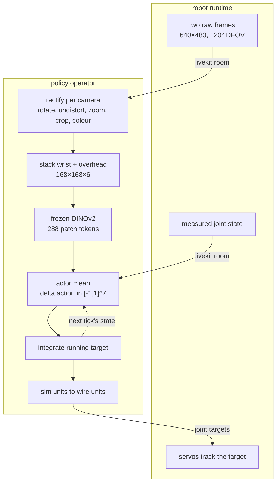

# making zero-shot sim2real possible on so-frame

for the past months, we've been designing a cheap robot rig for benchmarking our transport at livekit, called so-frame.

while our benchmarking focus so far has been on training behavior cloning models and collecting data for them, it has always been a core question of mine (after hours of collecting data): "can't the robot self-learn these behaviors?"

after all, we are doing very simple tasks such as picking and placing objects in a very controlled environment.

so as we released so-frame to the world, we also designed and released its digital twin, with the vision that we will train a rl model that reduces our need to collect data for the rig, be it rl from scratch or from prior demonstrations.

our aim is very simple: make sim2real work end to end, the same way our bc policies work, purely through visual and proprioceptive states.

today, we got it to work reliably and this is a write-up on how we did it.

i adapted squint, then diverged and swapped out the encoder to improve sim2real performance. that swap turned out to be the thing that decided it. four encoders learned the task in simulation. only one of them survived contact with the real robot.

<!-- IMG 1 (hero): matched sim | real rollout. see blog-viz/README.md -->

> _hero clip pending._

# what is the environment?

the so-frame's full description can be found [here](#).

in short, the robot is an SO-101 5-DOF arm mounted on a linear rail, giving 7 actuated DOF total:

- `dof_slider`, the rail (linear travel along the work surface)
- `shoulder_pan`, `shoulder_lift`, `elbow_flex`, `wrist_flex`, `wrist_roll`, the arm
- `gripper`, a parallel jaw

the arm and rail are bolted to a frame with a diffuse lightbox work surface (near-white, evenly lit). two cameras are rigidly mounted to the frame via printed holders:

- wrist camera, follows the gripper, used for fine grasp alignment
- overhead camera, static, sees the whole work surface, used to localize the objects

both are cheap camera modules, the specifications of which are not important to reproduction, as we built a tool that helps us align simulation cameras with real cameras, which will be mentioned later. the entire frame, arm, rail, cameras, and lightbox panels are one URDF, so the simulated twin and the real rig share the same kinematics and the same calibrated camera mounts (camera poses come from forward kinematics of the URDF links, not hand-measured offsets).

# what is the task?

the task for the robot is to pick up a cube on the work surface and place it in a bin.

- cube: 20 mm, ~3.2 g, blue.
- bin: 100 mm square, 30 mm tall, 2 mm walls, so a 96 mm opening 28 mm deep. yellow.

both are printed from the same CAD the simulation loads its meshes from, and the exporter asserts the dimensions against the constants the environment uses, so changing the CAD without changing the task fails loudly instead of quietly.

in the simulation, the cube and bin's positions and rotations are randomized for each episode. both come from one zone, 458 × 728 mm, the bin placed first and the cube rejection-sampled until it clears the bin by 50 mm.

the zone is not a design choice, it is a measurement: it is exactly what the overhead camera sees, the largest rectangle inside its footprint, checked at both the cube's height and the taller bin's rim. the policy is vision only, so a spawn outside that is not a hard episode, it is an unobservable one.

what it is deliberately *not* clipped to is the arm's reach. top-down reach covers only about 55% of the zone's x, all of it lost on the far side where the camera sees panel the arm cannot cross, so roughly half the spawns are unreachable by construction. that caps success below 1.0 on purpose, and it means a number from this environment is not comparable to one from a zone drawn inside the reach envelope. the runs below predate the change and used the older 258 × 710 mm zone, which was clipped to reach.

it is also much longer along the rail than across it, so most spawns put the two objects too far apart to reach without driving the rail.

the task is considered successful if all of the following hold: the cube settles inside the bin, the cube and the robot are both static, and the robot touches neither the cube nor the bin. episodes are capped at 200 steps, each step one action. the robot is controlled at 10 hz, so each episode has 20 seconds. that budget is sized against rail travel, which dominates everything else: park to cube to bin costs about 110 steps at a far spawn.

the simulator we use is ManiSkill3 from Sapien. it is a popular framework with state of the art visual rendering, which is why i picked it, as we want to focus on visual learning instead of the state-based learning mostly used in locomotion. furthermore, ManiSkill's author has an official implementation for sim2real on the so101 which is of great reference.

# formalizing the problem

this part can be hard for some readers, as i'll formalize the RL environment mathematically as a Markov Decision Process. if you don't know what that is, i recommend watching [this video](#), as well as reading up on [this RL cheat sheet](#) from OpenAI.

ours is really a POMDP, a partially observable one. the agent never sees the true state (object poses, physics parameters), only what the sensors let through. that is the two camera frames stacked on the channel axis, plus 14 numbers of proprioception:

$$o_t = \Big(\phi(\mathbf{X}_t),\ \big[\tilde{\mathbf{q}}_t,\ \mathbf{q}^{\text{tgt}}_t\big]\Big)$$

$\phi$ is whatever the encoder does to the pixels before the policy sees them, and the difference between those choices is most of this article.

$\tilde{\mathbf{q}}_t$ is the 7 measured joint positions with 5° of gaussian noise on each, to model real encoders.

$\mathbf{q}^{\text{tgt}}_t$ is the running target, and it is worth explaining properly because it is the reason proprio is 14 numbers and not 7. the low-level controller is positional: it is always driving toward wherever the target currently sits, and the arm physically lags behind it. so two identical arm poses with different targets evolve completely differently over the next few steps. the measured pose alone is ambiguous and the problem stops being Markov. telling the policy both where the arm is and where it was last told to go fixes that. at deploy the inference loop maintains the same integrated target and sends it to the servos, so the meaning carries over one to one.

that layout is a contract, not a convention. the 14 fields and their order are measured off the live training env and written into the checkpoint, so deploy assembles its vector from that record instead of assuming a width.

the action is a normalized delta, integrated into that target and clipped to the joint limits:

$$\mathbf{q}^{\text{tgt}}_{t+1} = \mathrm{clip}\!\big(\mathbf{q}^{\text{tgt}}_t + \mathbf{a}_t \odot \boldsymbol{\Delta}_{\max},\ \mathbf{q}_{\text{lo}},\ \mathbf{q}_{\text{hi}}\big), \qquad \mathbf{a}_t \in [-1,1]^7$$

so an action of $+1$ moves that joint's target by its full step. a PD controller chases the target at 100 hz while actions arrive at 10 hz. the gripper is continuous, all the way to the real robot.

note that a delta per control period is a velocity. that matters later.

### the reward

the reward is a monotonic staircase. each stage is a fixed rung plus a bounded amount of shaping, and every stage's maximum sits below the next stage's floor, so a higher stage overrides the lower one instead of adding to it.

$$\text{reach } [0, 1.5] \;<\; \text{grasped } [2, 3] \;<\; \text{holding } [4, 5] \;<\; \text{released } 6 \;<\; \text{success } 10$$

the ordering does the work that a pile of bonuses and hover taxes used to do badly. "let go of the cube, don't just hold it over the bin" is encoded once, by $5 < 6$: holding is a plateau you can only beat by releasing. and because the ladder is monotonic, regression handles itself, since dropping the cube falls to a lower rung on its own.

the shaping inside the stages:

$$r_{\text{reach}} = \underbrace{0.5\big(1 - \tanh(5\,d_{xy})\big)}_{\text{align over the cube}} + \mathbb{1}[\,d_{xy} < 0.03\,]\underbrace{0.5\big(1 - \tanh(5\,d_z)\big)}_{\text{then descend}} + \mathbb{1}[\text{on it}]\underbrace{0.5\,(1 - o_{\text{grip}})}_{\text{then close}}$$

$$r_{\text{carry}} = 1 - \tanh(5\,\|g - p_{\text{item}}\|), \qquad r_{\text{hold}} = o_{\text{grip}}$$

reaching is deliberately top-down. it always pays for closing the horizontal gap, but the vertical term only switches on once the tool is within 3 cm horizontally, so the policy learns to get over the cube and drop onto it. scooping in from the side wrecked the grasp on the real rig.

the two jaw terms are mirror images and they took the longest to get right. opening pays inside the holding stage, so a jaw opening over the bin climbs continuously toward the released rung instead of leaping off a plateau. closing pays at the top of reaching, but only while the tool is genuinely on the cube. each is capped below the next rung, so a jaw shutting on nothing is still worth less than a real grasp. an earlier version of this made the gripper binary to force a clean release, which was treating a reward problem as an action-space problem. with both ramps in place the policy commits on its own and the hack came out.

there are no penalty terms. every limit that used to be one is structural now: speed is capped by the action space and torque by the servos' stall value.

one last piece. carrying aims 5 cm above the bin rim, not at the floor. the opening is 96 mm and the jaw cannot swing open at depth inside it, so a policy shaped to insert deep becomes physically unable to let go. aiming high lets the jaw open, gives the arm margin to clear the wall, and lets gravity finish.

# randomizing the environment

before we go on to what kind of rl method we use, i'd like to introduce domain randomization.

a policy trained in one simulator learns that simulator's quirks: its exact lighting, its exact friction, its exact camera pose. reality is then a distribution shift and the policy shatters. domain randomization is the standard fix. instead of training in one simulation you train across a distribution of them, and if it is wide enough, reality is just another sample.

i think of the gap as two jobs. appearance matching makes sim look like the one real rig, and it gets its own section. robustness makes the policy not care how that rig differs from itself run to run. randomization is the second job.

| randomization | range |
| --- | --- |
| ambient lighting | 0.2 to 0.5 per channel |
| camera pose and FOV | ±2 mm, ±1°, ±1° |
| gripper gains | stiffness 500 to 2000, damping 50 to 200 |
| arm and rail gains | stiffness 600 to 1400, damping 60 to 140 |
| proprio noise | 5° std on joint reads |
| cube friction | 0.5 to 1.0 |
| colour jitter | brightness/contrast/saturation 0.3, hue 0.05, per camera |
| sensor realism | gamma 0.7 to 1.4, ±10% white balance, noise, blur, a compression proxy |

camera pose and FOV are drawn when the scene is built rather than every episode, since they are properties of a rig and not of a moment.

object colour is deliberately not randomized. it costs a lot of sample efficiency and there is exactly one real rig, whose cube and bin are a known blue and yellow. so we match instead, and the policy gets to use colour as a reliable cue. how heavily an encoder leans on that cue turns out to matter enormously.

# improving upon prior work

with our environment defined mathematically, we'll need to worry about how do we train our policy: this means we'll have to pick our rl method, would it be value based, or policy gradient, or would it be both?

### 1. squint

this leads us to [squint](https://arxiv.org/abs/2602.21203), which is a zero shot sim2real method on the SO101 published in february this year.

thanks to pratham for introducing me to this method on his twitter thread and sharing his squint notes with me.

the answer to the question above is both. squint is a visual Soft Actor-Critic, off-policy and entropy-regularized, so parallel simulation can fill a replay buffer fast while a learned critic squeezes many gradient updates out of every environment step. instead of the plain discounted return it maximizes return plus an entropy bonus,

$$\pi^\star = \arg\max_\pi\ \mathbb{E}_\pi\!\Big[\textstyle\sum_t \gamma^t\big(r_t + \alpha\,\mathcal{H}(\pi(\cdot\mid o_t))\big)\Big], \qquad \gamma = 0.9$$

which pays the policy to stay stochastic rather than collapse onto the first behavior that scores. the temperature $\alpha$ is auto-tuned so exploration fades on its own, and at deploy the actor is deterministic.

there are three networks. a small conv stack over the two cameras stacked to H×W×6. an MLP actor that fuses the visual features with proprio. and a distributional critic: instead of a scalar Q-value each critic predicts a distribution over returns across 101 atoms spanning $[-20, 20]$, evenly spaced candidate returns with a probability on each. the Bellman target shifts every atom by $r + \gamma z_i$, projects it back onto the fixed grid, and the loss is a cross-entropy over a two-network ensemble. for a staged reward like ours this is much more stable than scalar Q-learning.

then the trick it is named for. the cameras render at 128×128 and are area-downsampled to 32×32 before the network sees them. the policy squints. this beats rendering natively at 32 because a native 32 px render point-samples the scene, so a small object flickers or vanishes between frames, while averaging a 4×4 block leaves a stable soft signal. and it is fast, a full run in well under two hours on one GPU.

but look at what squinting costs on this task.

the cube is 20 mm on a 710 mm workspace. it covers a 5×5 block of the 128 px render, and **two pixels** of the 32 px squint. no shape, no edges, no orientation. the only property that survives is hue, which is why every run here paints the cube blue and the bin yellow instead of the black they are by default. at 32 px, colour is the only cue the CNN has.

hold that thought.

### 2. dinov2 encoder

squint has a problem when going to higher resolution, which is that it focuses too much on unwanted visual artifacts such as shadows and wires. a CNN trained purely inside a simulator has never seen the real world, so it has no prior for what is signal and what is a rendering artifact. to improve upon this, i then switched the from-scratch CNN encoder for a DINOv2 pre-trained encoder, ViT-S/14 with registers, trained self-supervised on real images at scale.

it stays frozen on purpose. fine-tuning it on sim renders would just re-teach it the simulator's quirks and throw away the prior that motivated the swap.

the middle column is the reason to bother. the same frozen backbone on a sim render and on a rectified real frame, both painted by a single shared PCA so the colours are comparable rather than each image being flattered by its own projection. the surface, the arm and the frame edges take the same colours in both worlds, and we did not have to train for it.

the mistake to avoid is treating DINOv2 like a CNN, flattening its output into one vector and moving on. it does not hand you a feature image, it hands you tokens. at 168 px, twelve of its 14-pixel patches a side, each camera is a 12×12 grid of 384-dim patch tokens, 288 for the pair. so the head consumes tokens: both grids go in jointly with a learned per-camera embedding, self-attention runs over the sequence, and a learned readout token collects the answer. this follows the [Patch Policy](#) recipe, whose claim is exactly that dense representations are what embodied control needs.

that is testable rather than believable, so i built the control. `dino_global` is the same frozen backbone at the same resolution with the same head width and update ratio, differing in one thing: the patch grid is collapsed to one vector per camera before the head sees it, either the CLS token or the mean over patches. 288 tokens against 2.

one practical note. since the backbone is frozen its tokens never change for a given frame, so they are computed once per environment step in an observation wrapper and cached in the replay buffer instead of recomputed on every gradient batch.

# matching simulation to real

domain randomization widens the distribution. this section centers it on the real rig.

**colours and lighting.** sim's linear base colours are picked to land on the real ones under sim's own lighting. nothing in the scene is pure black or pure white, since a pure black object returns no light and renders as a flat silhouette with no shape cues, and a pure white one clips under the softbox the same way. the shadow-casting key light is off. it used to be on, faintly, but the real lightbox produces no directional shadow at all, only soft contact darkening at an object's base, so a cast shadow in sim was an artifact for the policy to key on. turning it off narrowed the gap and saved a geometry pass per camera per step.

**cameras.** the real modules are 120° wide-angle with real barrel distortion. you cannot just set the sim camera's FOV to the lens spec, because a pinhole render and a fisheye see different fractions of the scene. so instead of making sim render like a cheap lens, we do the opposite and rectify reality into sim's geometry: undistort with a $k_1/k_2$ plus focal model, rotate (the overhead camera is mounted sideways), zoom and crop to the sim's field of view, then correct colour with a per-channel gain and a gamma.

those parameters come from a tool that drives the real arm while rendering the sim cameras live beside the rectified real feed, with a blend slider between them. the mapping it writes is the same file the deploy loop replays, so the frame the policy trained on and the frame it sees on the robot are formed by an identical transform.

driving the arm while fitting is the requirement, not a convenience. the wrist camera's view is almost entirely jaws, so a fit checked at one pose tells you nothing about whether it holds as the arm moves. an earlier two-step flow, capture a frame then align offline, could only ever validate one pose.

the figure is a check rather than a claim. sim is rendered at the exact joint pose the real frames were captured at, and the cube and bin are stood at positions read back out of the rectified real frame by un-projecting them onto the work surface. that the arm, the objects and the frame extrusions land on top of each other is what says the mapping is right. it also shows where it is loosest: the overhead camera's FOV was fitted against the rig, the wrist's is inherited from the MJCF twin, so the wrist's objects sit a little large.

**speed.** the real STS3215 servos are slow, especially driving the rail, and a policy trained to command motion the hardware cannot track winds its target up ahead of the arm, which then overshoots and oscillates. so we measured it: drive each joint to its limit in a manual control UI and read the achieved speed off the observation stream. the arm manages 29 to 34 deg/s and the rail about 7 cm/s. sim's per-step deltas come straight from those numbers, 0.05 rad and 7 mm per step at 10 hz.

it is worth saying which limit does the work here, because it is tempting to assume torque. it does not. 3 N·m against the servo's damping would reach around 280 deg/s, an order of magnitude past the real arm. speed is enforced by the action space.

**torque.** 3 N·m is where the servos stall, so that is each joint's force limit in sim. an over-powered sim arm learns to muscle through imprecise grasps and lean on the work surface, which does not transfer because the real servo simply stalls. at the real stall torque the low top-down grasp actually gets easier, since a weak arm settles onto the cube instead of slamming into it.

# training notes

training is 12M environment steps on a single RTX PRO 6000, replay retention of 2 episodes per env, batch 512, and squint's hyperparameters mostly untouched. the squint CNN runs 1024 parallel envs at 2833 environment steps per second and finishes in about ninety minutes. the dino heads run 512 envs, and the patch head is the expensive one at 341 steps per second and ten hours.

four encoders, same task, same reward, same retention, same budget.

| encoder | first success | best | sustained |
| --- | --- | --- | --- |
| `dino_patch`, 12×12 grid | 1.75M | **1.00** | **0.88** |
| `dino_global`, mean-pooled | 2.75M | 0.89 | 0.67 |
| `dino_global`, CLS token | 7.75M | 0.80 | 0.58 |
| `squint` CNN at 32 px | 3.50M | 0.71 | 0.52 |

the dense grid wins on both axes. it blooms first and holds the highest level once it is there. collapsing the same features to one vector per camera costs about twenty points of sustained success, and collapsing to the CLS token costs another nine and delays the bloom by five million steps. the only difference between the top row and the middle two is whether the patch grid survives to the head.

the right panel of that figure is the part i would most want you to take away. before the reward ladder gained its jaw-closing ramp and the horizon came down to 200 steps, the same CNN ran five times, three of them separate seeds, twelve million steps each. it never placed the cube once. not rarely, never. nothing about the encoder changed between those runs and the one that reached 0.71. i spent a while suspecting the architecture when the reward was the problem.

three more things from the run history:

- **entropy collapse is normal.** the auto-tuned temperature bottoms out around 1e-4 in the first 600k steps of every run, successful or not. printed with three decimals it reads as 0.000, which makes it look worse than it is.
- **the final eval is not the number you want.** the patch head does not converge, it wanders. after peaking at 1.00 it spent seven million more steps between 0.69 and 1.00, ending at 0.83. an earlier run of the same architecture did the ugly version, peaking at 0.74 then falling to flat zero. every checkpoint deployed here is a best checkpoint, and the one driving the robot is from step 6.0M of a 12M run.
- **one run is not an experiment.** the CNN has high seed variance. one seed of a proven config finished at exactly 0.000 while another reached 0.688. eval is 35 episodes, so 0 out of 35 is not sampling noise off a working policy, it is a real policy state.

# deployment

my so-frame is built to be a remote rig and so i always connect to it remotely through livekit portal.

in this setup, the robot acts as a participant connecting to the policy (also as a participant) through a livekit room.

the robot exposes its controls while sending raw camera frames to the policy. on the policy side, a simple bridge is written to rectify reality to simulation constraints. sending raw frames is deliberate: the human watching the web UI gets the full wide-angle view, and the policy privately reconstructs its narrow 168 px version before every inference.

the bridge itself is thin, so the network's tensors never leave sim space: radians to degrees for the arm, metres to a normalized 0-to-100 position for the rail. one joint, `wrist_roll`, carries a measured 90° offset because its calibrated zero is not the URDF zero. everything else is identity, checked against a live arm rather than assumed.

now, back to that sentence about actions being velocities. sim integrates one every step, so deploy has to keep applying an action every tick until a new one replaces it. the first version applied each action once and froze the target, and the arm stalled between decisions.

the mirror problem is that the sim arm reaches its target within a step and the real arm lags. if the target keeps advancing while the arm is behind, it winds up, and by the time the jaw closes the arm has sailed past the cube. the fix is a lag budget: the target only advances while every gated joint is within a few action steps of its measured pose, and the same threshold gates the next decision. it is a velocity-clamped ramp rather than a stopwatch, and it trades directly against speed.

| budget | decisions/s | rail speed | 0.49 m traverse |
| --- | --- | --- | --- |
| 0.5 | 1.4 | 1.00 cm/s | 49.4 s |
| 1.0 | 2.3 | 1.55 cm/s | 31.8 s |
| 2.0 | 3.8 | 2.60 cm/s | 19.0 s |
| 4.0 | 6.8 | 4.53 cm/s | 10.9 s |

two exclusions earn their place. the gripper is exempt from the shared budget, because its whole range is 9.6 action steps and a jaw closed on the cube sits several steps short of its command for as long as it holds, so a shared gate would never clear again. it carries its own generous lead cap instead, since that lead is the grip force: a position servo only pushes as hard as the distance it is asked to close. and nothing advances without frames, because a lost camera must not mean the arm keeps gliding blind on a stale command.

> _deploy `--viz` screenshot pending._

### only one of them survived

here is the part i did not expect. in simulation all four encoders learn the task and rank in a sensible order, 0.52 to 0.88 sustained. on the real robot that ranking collapses into a binary. only `dino_patch` works. the others do not degrade gracefully, they fail.

with hindsight the explanation is in the squint figure. at 32 px the real cube is two pixels and hue is all the CNN can key on, which makes it a colour detector, and colour is exactly the channel a cheap USB camera under a lightbox is least reliable about. that is what the gain and gamma in the mapping correct for and what the augmentation trains against, but there is no other cue to fall back on when the correction is imperfect. the collapsed DINOv2 variants have the real-image prior but have thrown away where anything is. one vector per camera says "a blue thing is present" far more easily than "it is there".

the dense grid keeps both, and it is the only one of the four with enough left over to absorb the difference between a render and a rectified photograph of a room.

so the simulation number was not the thing to optimize. an encoder that reaches 0.71 in sim and zero on the robot is not eighty percent as good as one that reaches 0.88 and works.

> _closer clip pending: a continuous real rollout, no human in the loop._

# takeaway

this is just a simple proof of concept (which is reliable and reproducible), it took me 1 week for the rl env and another to successfully adapt squint and more to the rl environment and to real life.

the encoder turned out to be a sim2real decision rather than an accuracy decision. four learned the task, one transferred, and the sim success rate barely hinted at which. what mattered was whether the representation keeps *where things are* or only *what is present*.

and suspect the reward before the architecture. five runs and three seeds at exactly zero were not an encoder problem.

rl is more than just picking and placing stuff. since this is visual and proprio only, the hardest problem is now engineering the reward function.

but even before the reward function, we can make the policy learn useful behavior through prior demonstrations.

therefore, this work unlocks an immense space for hobbyists to explore and reproduce state of the art results in modern robot learning.
