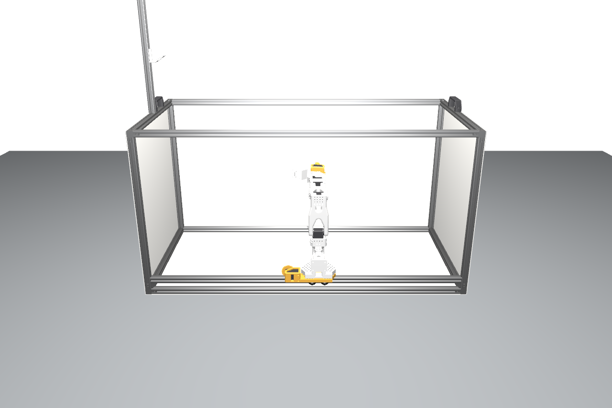
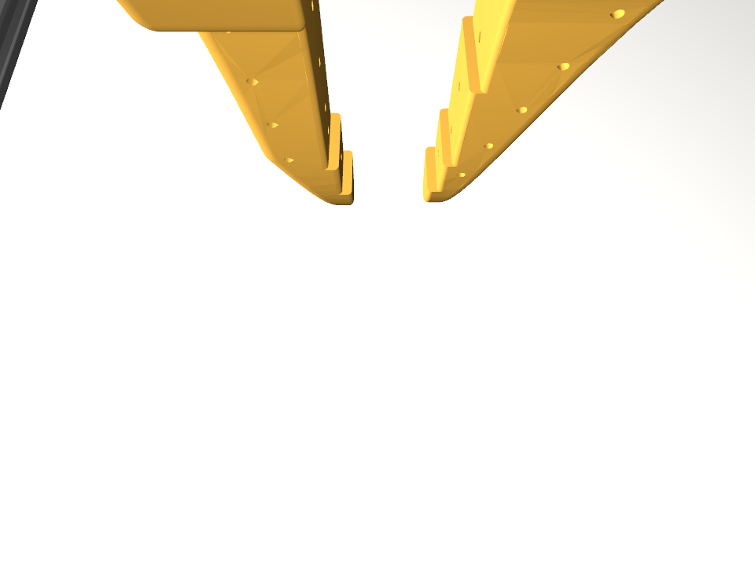
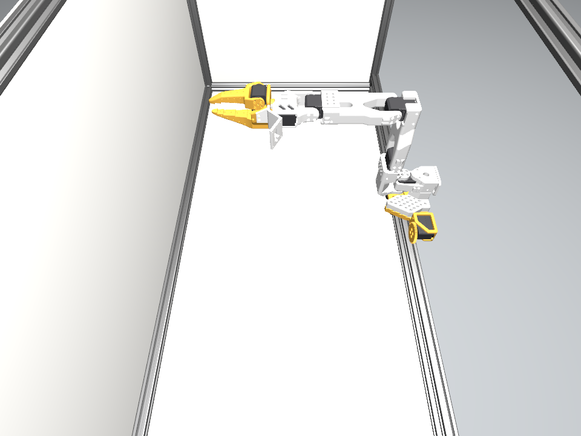

# SO-101 on Linear Frame (OpenUSD)

`so101_on_frame.usd` is a single self-contained USD scene (geometry baked in, Z-up, meters)
with physically-based materials and soft overhead lighting. Open it in usdview, Blender,
Omniverse, Houdini, etc.



## Materials

Each part is bound to a `UsdPreviewSurface` chosen to match the real build:

| Material | Parts |
|----------|-------|
| **Aluminium** (metallic) | 2020 extrusions, corner/angle brackets, gantry plate |
| **Matte mica** (white, rough) | the light-diffusing side panels |
| **PLA (white)** | SO-101 printed arm parts, camera holder, wrist-cam mount |
| **PLA (orange)** | gripper fingers, `base_mount`, `pinion` |
| **Plastic (black)** | servos/motors, PCBs, handles |
| **Steel** (metallic) | bearings, screws, nuts, V-wheels, servo horns |

Colors follow the same scheme as the URDF/MJCF.

## Lighting

Soft light from above: a large rectangular **area light** over the frame (like the softbox
in the real rig) plus a dim **dome** for ambient fill.

## Cameras

Three cameras: `/World/Camera` (the framing view above) plus the two on-robot cameras at the
same frames as the URDF/MJCF:

| `frame_wrist_camera` | `frame_overhead_camera` |
|:---:|:---:|
|  |  |

## Render

```bash
usdrecord --camera /World/Camera --imageWidth 1600 so101_on_frame.usd out.png
# or a robot camera:
usdrecord --camera /World/frame_wrist_camera --imageWidth 960 so101_on_frame.usd wrist.png
```

(Any USD-aware renderer works; the preview above is Hydra/Storm.)

## Regenerating

Baked from `../urdf/so101_on_frame.urdf` (default/calibrated pose) with material assignment
by part, vertex welding, and the light + camera rig added.

> The shipped `.usd` predates the URDF's visual-geometry trim, so it still contains the
> handles, M5 screws and rail drive internals that the URDF has since dropped (see
> [the URDF README](../urdf/README.md#visual-geometry)). Re-baking from the current URDF
> will produce a lighter asset without them. The physics asset below is imported from the
> MJCF instead, which was never trimmed, so it is unaffected.

## Physics-enabled asset (Isaac Lab)

`so101_on_frame.usd` above is visual-only (no rigid bodies, joints, or collision). For
Isaac Lab, `mjcf_import/so101_on_frame/so101_on_frame.usda` is a separate, physics-enabled
asset generated by Isaac Sim's own MJCF importer from `../mjcf/so101_on_frame.xml` (which
already has real collision on the lightbox's panels, see that folder's fix), rather than by
hand-authoring UsdPhysics schemas:

```bash
source ~/isaac/activate_isaac.sh   # or wherever Isaac Sim/Lab is installed
python3 import_mjcf.py             # regenerate from the MJCF, sets joint drive gains too
python3 isaac_validate.py          # drop-test the floor panel's collision
```

7 rigid bodies (rail + 5 arm joints + gripper; the rest of the frame collapses into one
static base body), 8 joints (7 actuated + 1 fixed-to-world), 1 articulation root.

**Joint drives**: the importer doesn't resolve MuJoCo's `<default class="X"><position
kp="..."/>` inheritance into its own gain/bias format, so it applies a `DriveAPI` to each
joint but leaves stiffness/damping at zero (an undriven arm collapses under gravity).
`import_mjcf.py` sets these explicitly after import, starting from the MJCF's own `kp`
values (400 for the rail, 20 for the arm/gripper, matching `sts3215.xml`), same as
`rl/environments/mjlab`'s own stance on actuator gains ("reasonable *starting* values ... not calibrated").

**Timestep**: with those gains, the default Isaac Sim physics timestep (1/60 s) is
numerically unstable (joint positions diverge within ~100 steps). It's ~8x coarser than
the MJCF's own validated 0.002 s. Use a matching timestep (e.g.
`World(physics_dt=1/500)`) or re-tune the gains for whatever timestep the consuming Isaac
Lab environment actually runs at.

**Known follow-ups, not yet done**:
- The imported asset uses plain per-part colors from the MJCF, not the nice PBR materials
  (aluminium/mica/steel/etc.) authored in `so101_on_frame.usd` above. Transferring those
  onto the physics asset (matching meshes by name/link) is a reasonable next step for
  anyone wanting good-looking Isaac Lab renders.
- Joint drive gains are untuned starting values, same caveat as `rl/environments/mjlab`'s.
